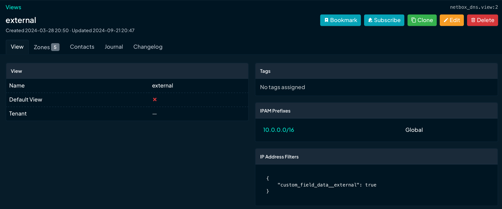
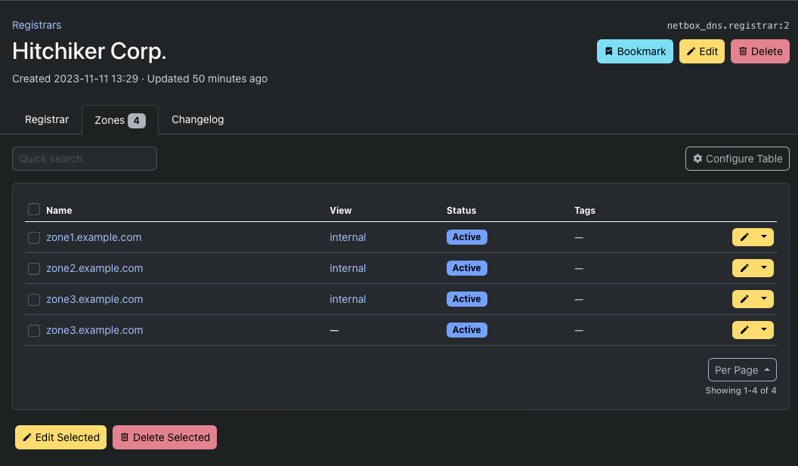

# Using NetBox DNS
NetBox DNS is a plugin for NetBox designed to manage DNS data. In the current version it supports View, Name Server, Zone, and Record objects for simple DNS deployments. Its main features include:

* Generation of the NS records for a zone from the assigned Name Server objects as defined in [RFC 1035, Section 3.3.11](https://datatracker.ietf.org/doc/html/rfc1035#section-3.3.11)
* Generation of the SOA record for a zone from the component fields defined in [RFC 1035, Section 3.3.13](https://datatracker.ietf.org/doc/html/rfc1035#section-3.3.13)
* Optional management of PTR records for A and AAAA records if the reverse zones are also in NetBox DNS
* Optional generation and update of the SOA serial number for a zone if zone data or data of any record within the zone is updated
* API endpoints that can be used to export View, Name Server, Zone and Record data via the NetBox REST or GraphQL APIs
* Basic integrity checks of the entered data
* Optional organisation of zones in views, i.e. to facilitate split-horizon DNS setups
* Management of domain registration related information, such as registrars and contacts related to WHOIS information
* Support for NetBox custom fields, custom links, export templates etc.
* Support for NetBox tenancy

## Installation and Configuration
The installation of plugins in general is described in the [NetBox documentation](https://netbox.readthedocs.io/en/stable/plugins/).

### Requirements
The installation of NetBox DNS requires a Python interpreter and a working NetBox deployment. Supported versions are currently:

* NetBox 3.5.0 or higher
* Python 3.8 or higher

### Installation of NetBox DNS
NetBox DNS is available as a PyPi module and can be installed using pip:

```
$ source /opt/netbox/venv/bin/activate
(venv) $ pip install netbox-plugin-dns
```
This will install NetBox DNS and all prerequisites within the NetBox virtual environment.

### Adding NetBox DNS to the local NetBox requirements
To have NetBox DNS updated when a NetBox update is performed, include it in the local requirements file for NetBox:

```
echo netbox-plugin-dns >> /opt/netbox/local_requirements.txt
```
If the local requirements file does not exist, this command will create it.

This will ensure that NetBox DNS will be updated every time the update script provided with NetBox is executed.

### Running the Django database migration procedure
NetBox DNS requires some tables for its data models within the NetBox database. Execute the following command to create and update these tables:

```
/opt/netbox/netbox/manage.py migrate
```
Now NetBox DNS should show up under "Plugins" at the bottom of the left-hand side of the NetBox web GUI.

## Object types
Currently NetBox DNS can manage four different object types: Views, Name Servers, Zones, and Records.

### Views
Views are a concept to optinally partition the DNS namespace into groups of zones that are isolated from each other. They are mainly used for split horizon DNS setups, for example in cases when there is a different DNS resolution requirement for external and internal clients where external clients do not get the same set of names, or see different IP addresses than internal clients in case of NAT setups. Other scenarios are possible as well.

When Views are defined, each zone can optionally be associated with a specific view. There are two consequences of using views:

* Zone names do not need to be unique provided the zones with identical names are not in the same view (or one of them does not have a view assigned)
* When a PTR record is created for an A or AAAA record, the record is created within a reverse zone that is in the same view, or that does not have a view associated with it when the source zone doesn't have one either.

Views only affect zones (and consequentially records within them), not name servers.

Views that have zones associated with them cannot be deleted, as this would incur a high risk of major data loss. If a view is to be deleted, move all zones from the view to a different one or remove the view from the zones and delete it afterwards.

When a zone is moved from one view to a different one or when a zone is removed from all views, NetBox DNS checks for conflicting zone names and PTR records and refuses to perform the action. In this case, manual intervention is required.

A view detail view:



If the view is used by any zones, there is an additional tab listing the zones that use the view.


Additonally there is another tab showing the change log for the view.


#### Permissions
The following Django permissions are applicable to View objects:

Permission               | Action
----------               | ------
`netbox_dns.add_view`    | Create new view objects
`netbox_dns.change_view` | Edit view information
`netbox_dns.delete_view` | Delete a name server object
`netbox_dns.view_view`   | View name server information

To use tags, the `extras.view_tag` permission is required as well.

#### Fields
The following fields are defined for views:

Field           | Required | Explanation
-----           | -------- | -----------
**Name**        | Yes      | The name of the view
**Tenant**      | No       | The tenant the view is assined to
**Description** | No       | A short textual description of the view
**Tags**        | No       | NetBox tags assigned to the view. Tags can be used to categorise views by arbitrary criteria such as Production/Test/Development systems

### Name servers
Name server objects correspond to name servers in the DNS infrastructure and are basically fully qualified domain names (FQDN) of hosts running name server instances.

A Name Server object is required for a zones MNAME field in the SOA record, defining the primary server for the zone data, and for NS records inside each zone, defining the name servers that are serving as data sources for a zone's authoritative information. The primary name server is not necessarily one of the authoritative name servers.

Without any name servers in the system, zones cannot be defined as a name server object is strictly required for the SOA MNAME field, so at least one name server must be defined before adding zones or records to NetBox DNS.

Optionally, name servers can be tagged using standard NetBox tags. Tags must be defined in NetBox before they can be assigned to any object.

Name servers that are in use by zones for their SOA MNAME field cannot be deleted.

#### Permissions
The following Django permissions are applicable to Name Server objects:

Permission                     | Action
----------                     | ------
`netbox_dns.add_nameserver`    | Create new name server objects
`netbox_dns.change_nameserver` | Edit name server information
`netbox_dns.delete_nameserver` | Delete a name server object
`netbox_dns.view_nameserver`   | View name server information

To use tags, the `extras.view_tag` permission is required as well.

#### Fields
For name servers the following fields are defined:

Field           | Required | Explanation
-----           | -------- | -----------
**Name**        | Yes      | The fully qualified domain name (FQDN) of the name server
**Tenant**      | No       | The tenant the name server is assined to
**Description** | No       | A short textual description of the name server
**Tags**        | No       | NetBox tags assigned to the name server. Tags can be used to categorise name servers by arbitrary criteria such as Production/Test/Development systems

A name server detail view:


If the view is used as an authoritative name server for any zones, there is an additional tab listing the zones that use it.


Similarly, if the name server is listed as the primary nameserver for zones in their SOA MNAME field, there is another tab listing those zones.


Like with views, another tab lists the change log entries for the name server.

### Zones
Zone objects correspond to DNS zones to be served. Each zone contains resource records (RRs) of various types and zone specific configuration information that affects how the zone data is propagated and cached.

#### Permissions
The following Django permissions are applicable to Name Server objects:

Permission               | Action
----------               | ------
`netbox_dns.add_zone`    | Create new zone objects
`netbox_dns.change_zone` | Edit zone information
`netbox_dns.delete_zone` | Delete a zone object
`netbox_dns.view_zone`   | View zone information

To use tags, the `extras.view_tag` permission is required as well.

#### Generic Fields
The following fields are defined for every zone object:

Field           | Required | Default  | Explanation
-----           | -------- | -------  | -----------
**Name**        | Yes      |          | The name of the zone. This is an FQDN that represents the DNS domain containing host names to be resolved or one of the special zones `in-addr.arpa` or `ip6.arpa`, which are reserved for the resolution of IPv4 and IPv6 addresses by the DNS infrastructure
**View**        | No       |          | If the zone is associated with a view, the name of that view. In this case, the zone name is also prefixed with the view name in brackets to make zones easier to distinguish in lists. If the zone is not associated with a view, this field is not displayed
**Tenant**      | No       |          | The tenant the zone is assigned to
**Status**      | Yes      | Active   | The zone's status. Possible values are "active", "reserved", "deprecated" or "parked". All zone status except "Active" are considered inactive, which has implications for the records in a zone as well as for PTR records in reverse zones that are automatically generated for address records in the zone
**Nameservers** | No       | see [Default Settings](#config)) | The list of authoritative name servers for the zone
**Default TTL** | Yes      | see [Default Settings](#config)) | The default TTL for all records in the zone if none is specified
**Description** | No       |          | A short textual description of the zone
**Tags**        | No       |          | NetBox tags assigned to the zone. Tags can be used to categorise zones by arbitrary criteria

##### Zones without name servers

While the "Nameservers" list for a zone is not strictly required, zones without any name server records cannot be loaded by DNS servers. The detail view of a zone without any name servers shows an error message alerting the user of this fact.


This will make zone data exported from NetBox DNS unusable unless name servers are added before trying to load that zone.

##### Zones with unresolved name servers

Likewise, if a zone has nameservers defined, the name servers have domain names within a zone managed by NetBox DNS, and the name of the name server cannot be resolved within that zone, a warning message for every name server affected by this is displayed in the zone detail view.


This will result in problems notifying secondary name servers of zone updates, although generally the zone data is valid.

#### SOA fields
Zone specific data is maintained in the zone's "Start of Authority" (SOA) record. That record contains the following fields in the specified order:

SOA Field     | Explanation
---------     | -----------
**TTL**       | The time to live for the SOA record.
**MNAME**     | The FQDN of the primary name server for the zone
**RNAME**     | The mailbox of the person responsible for the zone. Note that the "@" in the e-mail address used here has to be replaced by a dot ".".
**SERIAL**    | An unsigned 32 bit number indicating the current state of the zone on the primary name server
**REFRESH**   | A 32 bit time interval in seconds that indicates the interval after which the zone should be refreshed from the upstream name server
**RETRY**     | A 32 bit time interval in seconds that indicates how long a name server should wait before retrying a failed refresh attempt
**EXPIRE**    | A 32 bit time interval in seconds that indicates the duration after which a zone that cannot be refreshed is no longer authoritative
**MINIMUM**   | A 32 bit time interval in seconds that is to be used as the default time to live (TTL) for records served from the zone. Note that this affects both positive and negative (NXRRSET) lookups

The zone's SOA record is assembled from these fields by contatenating them and putting them in parentheses. NetBox DNS creates the SOA record automatically from the information entered in the fields above.

All SOA fields are required. Default settings can be configured in the Django configuration file, see [Zone Default Settings](#zone_defaults)).

#### Domain Registration Fields
For zones that are registered as public DNS domains, there is a third set of fields available that reflects the domain's registration data.

Field                      | Required | Explanation
---------                  | -------- | -----------
**Registry**               | No       | The registry used to register the domain
**Registry Domain ID**     | No       | The domain ID assigned by the registry on registration
**Registrant**             | No       | The owner of the domain
**Administrative Contact** | No       | The administrative contact for the domain
**Technical Contact**      | No       | The technical contact for the domain
**Billing Contact**        | No       | The billing contact for the domain

All fields are optional.

If there is registration information for a zone, the zone's detail view contains an additional 'Registration' tab showing that information.


### Automatic SOA SERIAL generation
SOA SERIAL fields are crucial for the propagation of zone data from primary name servers to secondaries, as the process involves checking the zone's serial number on the secondary against the serial number on the primary and only performing the update when the primary has a higher serial number or the interval specified in the SOA EXPIRE field has passed.

This is especially important when PTR records are automatically created from A and AAAA records and an update to a forward zone thus can lead to one or several reverse zones being updated behind the scenes as well.

For that reason, NetBox DNS has the option of automatically creating SOA SERIAL numbers when zones or records within them change. This is controlled by the `Generate SOA Serial` checkbox in the zone create and edit views. If that check box is ticked, the serial number of the zone is calculated as maximum of the Unix epoch times (seconds since January 1st, 1970 00:00 UTC) of the last change to any records and the zone itself.

If the checkbox is not ticked, the SERIAL field is mandatory and the user is responsible for keeping track of zone changes. NetBox DNS will not touch the serial of that zone in any case.

A zone in detail view:


If there are records in the zone, a second tab shows a list of these records.


Another tab shows all managed records in the zone. Since at the very least there is  the SOA record, this tab is always visible. Note that managed records are not editable, so there are no 'edit' and 'delete'-buttons for records in the managed records tab.


### <a name="zone_defaults"></a>Zone Default settings
Zone default settings can be configured in the plugin configuration of NetBox. The following settings are available:

Setting                 | Variable               | Factory Default
-------                 | --------               | ---------------
**Nameservers**         | `zone_nameservers`     |
**Default TTL**         | `zone_default_ttl`     | 86400
**Generate SOA Serial** | `zone_soa_serial_auto` | True
**SOA MNAME**           | `zone_soa_mname`       |
**SOA RNAME**           | `zone_soa_rname`       |
**SOA SERIAL**          | `zone_soa_serial`      | 1
**SOA REFRESH**         | `zone_soa_refresh`     | 172800
**SOA RETRY**           | `zone_soa_retry`       | 7200
**SOA EXPIRE**          | `zone_soa_expire`      | 2592000
**SOA MINIMUM**         | `zone_soa_minimum`     | 3600

The settings can be set or overridden in the file `/opt/netbox/netbox/netbox/configuration.py` by defining new values in `PLUGINS_CONFIG` as follows:

```
PLUGINS_CONFIG = {
    'netbox_dns': {
        'zone_nameservers': ['ns1.example.com', 'ns2.example.com'],
        'zone_soa_mname': 'ns1.example.com',
        'zone_soa_rname': 'hostmaster.example.com',
    },
}
```

After changing the configuration, NetBox must be restarted for the changes to take effect.

### Records
Record objects correspond to resource records (RR) that within zones. NetBox DNS differentiates between records maintained by the user and so-called "Managed Records", which are created by NetBox DNS itself and cannot be edited manually. Currently there are three types of managed records:

* SOA records are created from the SOA data for a zone
* NS records are created from the name servers aasigned to a zone
* PTR records are created in reverse zones (zones ending `in-addr.arpa` or `ip6.arpa`) from address records in other zones.

There is exactly one SOA record per zone, so SOA records cannot be created manually at all. NS and PTR records do not have that kind of restriction and can be created and maintained manually if they have not been created by NetBox ("Managed Records'), although that should also be required in special cases.

#### Permissions
The following Django permissions are applicable to NameServer objects:

Permission                 | Action
----------                 | ------
`netbox_dns.add_record`    | Create new record objects
`netbox_dns.change_record` | Edit record information
`netbox_dns.delete_record` | Delete a record object
`netbox_dns.view_record`   | View record information

To use tags, the `extras.view_tag` permission is required as well.

#### Fields
For records the following fields are defined:

Field           | Required | Explanation
-----           | -------- | -----------
**Zone**        | Yes      | The zone in which the record is to be defined
**Type**        | Yes      | The type of the resource record. This can be one of a list of record types derived from [RFC 1035, Section 3.3](https://datatracker.ietf.org/doc/html/rfc1035#section-3.3), e.g. A or AAAA
**Disable PTR** | Yes      | A checkbox indicating whether a PTR record should be generated for an A or AAAA record automatically if there is a zone suitable for the PTR in NetBox DNS
**Name**        | Yes      | The name of the record, e.g. the simple host name for A and AAAA records
**Value**       | Yes      | The value of the record, e.g. the IPv4 or IPv6 addreess
**Status**      | No       | The status of a record. Pre-defined choices are "Active" (which is the default) and "Inactive"
**TTL**         | No       | The time to live for the record. If empty, the zone's SOA MINIMUM value or an explicitly defined zone default TTL value ($TTL in the master zone file) will be used. See [RFC 2308, Section 4](https://datatracker.ietf.org/doc/html/rfc2308#section-4)
**Description** | No       | A short textual description of the record
**Tags**        | No       | NetBox tags assigned to the name server. Tags can be used to categorise name servers by arbitrary criteria such as Production/Test/Development systems
**Active**      | N/A      | This field is not an input field, but it is created from the zone and record status. A record is marked inactive when either the zone that contains it or the record itself is not in an active status. **No PTR records are created for inactive A or AAAA records**

#### Automatic generation of PTR records
For the address record types A and AAAA, NetBox DNS can automatically generate and maintain the corresponding PTR records. For this to work, the following conditions must be met:

* The corresponding `in-addr.arpa` or `ip6.arpa` zone must be present in NetBox DNS
* The "Disable PTR" field must not be set to False (default is True)
* The address record and the zone containing it are in an active state

If, for instance, there is a zone `0.0.10.in-addr.arpa` is defined in NetBox DNS and an address record is created in a forward zone `example.com` with the address `10.0.0.1`, the corresponding PTR record will be created in the former zone as the reverse RR name for the IPv4 address `10.0.0.1` is `1.0.0.10.in-addr.arpa`.

When an A record is created for which a PTR record is not necessary or desired, the "Disable PTR" option can be used to inhibit the creation of the corresponding PTR record even if a reverse zone matching the address is present.

If the reverse zone does not exist in NetBox DNS, it will not be created automatically as it is not certain that the authority for that zone lies with the user. If, however, a matching reverse zone is created later on, the PTR records for all active A or AAAA records in NetBox DNS that match the new reverse zone will be created automatically (unless "Disable PTR" is set for a record).

Changing the name and/or value of an A record results in updating, moving or deleting the corresponding PTR record. Deleting an A record results in the corresponding PTR record getting deleted as well.

A record detail view for a standard record:


A record detail view for a managed record:


Note that for managed records there are no buttons for deleting, editing or cloning them as they cannot be managed manually. Otherwise they are handled exactly like standard records.

#### Displaying records
Records can either be displayed by opening the record list view from the "Reocrds" or "Managed Records" navigation item on the left, or per zone via the respective tabs in the zone defail view. In any case, the tables can be filtered by name, value, zone, or tags to narrow down the set of records displayed.

### Registrars
Registrar objects relate to the DNS domain registrarion and represent the registrar information for DNS domains related to zones. A DNS zone does not necessarily need to be registered: Zones that are not available via public DNS or that are sub-zones of registered zones do not require registration. In most cases registration information is only required (and possible) for second level domains.

Registrar objects relate to the registration institutions responsible for registering domains with the TLD registries. A list of accredited registrars is available on the [ICANN web site](https://www.icann.org/en/accredited-registrars).

#### Permissions
The following Django permissions are applicable to Registrar objects:

Permission                    | Action
----------                    | ------
`netbox_dns.add_registrar`    | Create new registrar objects
`netbox_dns.change_registrar` | Edit registrar information
`netbox_dns.delete_registrar` | Delete a registrar object
`netbox_dns.view_registrar`   | View registrar information

To use tags, the `extras.view_tag` permission is required as well.

#### Fields
The following fields are defined for registrars:

Field             | Required | Explanation
-----             | -------- | -----------
**Name**          | Yes      | A unique name for the registrar
**IANA ID**       | No       | A numeric ID assigned by the IANA on accredtiation of the registrar
**Referral URL**  | No       | The URL of the registrar's web presence
**WHOIS Server**  | No       | The WHOIS server for the registrar
**Abuse Email**   | No       | The Email address used to report abuse cases for a domain
**Abuse Phone**   | No       | The phone number used to report abuse cases for a domain

The fields are closely related to the WHOIS fields for the registrar for a domain. More information can be found on the [ICANN web site](https://www.icann.org/resources/pages/rdds-labeling-policy-2017-02-01-en)

#### Displaying Registrars
A registrar in detail view:


If there are zones registered for the registrar, a second tab shows a list of these zones.



### Contacts

#### Permissions
The following Django permissions are applicable to Contact objects:

Permission                  | Action
----------                  | ------
`netbox_dns.add_contact`    | Create new contact objects
`netbox_dns.change_contact` | Edit contact information
`netbox_dns.delete_contact` | Delete a contact object
`netbox_dns.view_contact`   | View contact information

To use tags, the `extras.view_tag` permission is required as well.

#### Fields
The following fields are defined for contacts:

Field               | Required | Explanation
-----               | -------- | -----------
**Name**            | No       | A name for the contact. The name is not necessarily unique, because the same person might have many DNS contacts, sometimes also called 'handles'.
**Contact ID**      | Yes      | A unique ID, usually assigned by the Registrar, that identifies the person or organisation. 
**Organization**    | No       | An organization the contact is associated with
**Street**          | No       | The street of the contact's address
**City**            | No       | The city of the contact's address
**State/Province**  | No       | The state or province the contact is located in
**Postal Code**     | No       | The postal code of the contact's address
**Country**         | No       | The ISO3166 country code of the contact's address
**Phone**           | No       | The phone number of the contact
**Phone Extension** | No       | The phone extension of the contact
**Fax**             | No       | The fax number of the contact
**Fax Extension**   | No       | The fax extension of the contact
**Email**           | No       | The Email address of the contact

The fields are closely related to the WHOIS fields for the registrant, admin contact, tech contact and billing contact for a domain. More information can be found on the [ICANN web site](https://www.icann.org/resources/pages/rdds-labeling-policy-2017-02-01-en)

#### Displaying Contacts
A contact in detail view:


If there are zones registered for the contact, a second tab shows a list of these zones.


## Name validation
The names of DNS Resource Records are subject to a number of RFCs, most notably [RFC1035, Section 2.3.1](https://www.rfc-editor.org/rfc/rfc1035#section-2.3.1), [RFC2181, Section 11](https://www.rfc-editor.org/rfc/rfc2181#section-11) and [RFC5891, Section 4.2.3](https://www.rfc-editor.org/rfc/rfc5891#section-4.2.3). Although the specifications in the RFCs, especially in RFC2181, are rather permissive, most DNS servers enforce them and refuse to load zones containing non-conforming names. NetBox DNS validates RR names before saving records and refuses to accept records not adhering to the standards.

The names of Name Servers, Zones and Records are all used as RR names in DNS, so all of these are validated for conformity to the mentioned RFCs. When a name does not conform to the RFC rules, NetBox DNS refuses to save the Name Server, Zone or Record with an error message indicating the reason for the refusal.

**Please note that unlike names, values are not validated. While this is theoretically possible and may be implemented at some point, it is not a trivial task as there is a plethora of RR types with even more value formats.**


### Validation options

There are some special cases that need to be taken care of:

* Some non-free operating systems accept underscores in host names, which are not permitted according to RFC1035 and by default rejected e.g. by BIND.
* Record types such as SRV and TXT can contain underscores as the first character of a label even in more standard-conforming implementations
* Given the large number of defined RR types, there might be other exceptions to the rules given in the RFCs

To take care of these cases, there are three configuration variables for NetBox DNS that adjust the validation of record names:

* `allow_underscores_in_hostnames` can be set to allow undercores being used in host names. Normally, underscores are only permitted in certain record types such as SRV, not in normal host names, but at least one operating system's DNS implementation does not follow the standard and allows this.
* `tolerate_leading_underscore_types` contains a list of RR types that allow an underscore as the first character in a label.
* `tolerate_non_rfc1035_types` contains a list of RR types that allow characters outside the set defined in RFC1035 to be used in RR names. Record types in this list are exempt from validation altogether.

#### <a name="validation_defaults"></a>Name validation default settings

Variable                                 | Factory Default
--------                                 | ---------------
`allow_underscores_in_hostnames `        | False
`tolerate_leading_underscore_types `     | `["TXT", "SRV"]`
`tolerate_non_rfc1035_types `            | `[]`

The settings can be set or overridden in the file `/opt/netbox/netbox/netbox/configuration.py` by defining new values in `PLUGINS_CONFIG` as follows:

```
PLUGINS_CONFIG = {
    'netbox_dns': {
        ...
        'allow_underscores_in_hostnames': True,
        'tolerate_leading_underscore_types': ["TXT", "SRV", "CNAME"]
        'tolerate_non_rfc1035_types': ["X25"]
    },
}
```

## International Domain Names (IDNs)

NetBox DNS supports International Domain Names (IDNs) in resource records. IDNs are domain names containing Unicode characters such as special characters in Latin scripts (e.g. 'ä', 'ö', 'ü', 'ç', 'å'), non-Latin scripts such as Arabic, Kyrillian or Kanji, or even Emoji. Since DNS does not support any of these, [RFC3492](https://www.rfc-editor.org/rfc/rfc3492) defines a mapping to so-called 'Punycode' that allows to translate between the limited character set supported by DNS and Unicode.

For instance, the IDN `exämple.com` is represented in Punycode as `xn--exmple-cua.com`, and `👁🐝m.com` as `xn--m-w22scd.com`. The Punycode representation of these names conforms to the validation rules enforced by NetBox DNS name validation. Since the Punycode representation cannot be parsed by most humans, NetBox DNS displays and accepts the Unicode representation where it is possible and necessary.


Internally, all IDNs are handled in a normalised form as Punycode. This ensures that the data coming from NetBox DNS can be handled by any tool and easily exported to name servers without any need for conversion to the standard format.

## Root Zones

NetBox DNS provides experimental support for managing root zones. Root zones are usually maintained by the ICANN, but there are special cases in which it may make sense to use internal root name servers. Normally the root zone, designated by the name `.`, cannot be used in NetBox DNS as the name fails validation, but if necessary this can be enabled by setting the configuration flag `enable_root_zones` in the file `/opt/netbox/netbox/netbox/configuration.py` as follows:

```
PLUGINS_CONFIG = {
    'netbox_dns': {
        ...
        'enable_root_zones': True,
        ...
    },
}
```

This feature is disabled by default.

## Uniqueness of Records

There is no standard requiring that records need to be unique within a zone, so it's perfectly legal to create records with the same name, type and value to a zone where the same record already exists. Use cases for this are, however, very rare, and on the other hand allowing duplicate records can cause problems with bulk imports and automated updates to zones.

For this reason there is a configuration setting that makes NetBox DNS enforce uniqueness of records in a way that no record can be created with a given name, type and value in a zone where an active record with the same values already exists:

```
PLUGINS_CONFIG = {
    'netbox_dns': {
        ...
        'enforce_unique_records': True,
        ...
    },
}
```

This feature is disabled by default.

Note that setting this option to `True` in an existing NetBox installation does not affect duplicate records that are already present in the database, and so it might make sense to clean them up manually or by script. It won't be possible to save any changes to either of the duplicate records as long as the other one is still present and active.

It can also be a useful strategy to set `enforce_unique_records` to `True` while doing bulk imports, then set it to the default value `False` after the imports are done if importing is a one-off task.

## Tenancy

With NetBox DNS 0.19.0 support for the NetBox tenancy feature was added. It is possible to assign all NetBox DNS objects except for managed records to a tenant, making it easier to filter DNS resources by criteria like their assignment to a customer or department.

Tenancy does not have any impact on uniqueness constraints within NetBox DNS.

The NetBox detail view for tenants shows a table of NetBox DNS objects assigned to a specific tenant.


The colums of the table on the left side are clickable and link to filtered lists showing the related views, nameservers, zones and records.

## IPAM Coupling

Starting with NetBox DNS 0.20.0, a new experimental feature providing coupling between NetBox DNS and NetBox IPAM data is available. This feature can be used to link IP addresses in IPAM to NetBox DNS address records. The old IPAM integration feature was dropped in favour of the new and improved functionality.

Thanks to Jean Benoît for this contribution!

### Enabling IPAM Coupling

The new experimental feature needs to be enabled in the NetBox configuration file by setting its flag:

```
PLUGINS_CONFIG = {
    'netbox_dns': {
        ...
        'feature_ipam_coupling': True,
        ...
    },
}
```

In addition, two custom fields on `ipam.IPAddress` objects are required for the feature to work. These custom fields can be created using the Django management command `setup_coupling`:

```
/opt/netbox/netbox/manage.py setup_coupling
```

In order to remove the custom fields and all related data, the same command can be used with the option `--remove`.

After these steps, a restart of NetBox is required.

### Using IPAM Coupling

With the new custom fields it is possible to automatically generate a DNS address record for an IP address. To do this, define a name for the record in the 'Name' custom field and select a zone in the 'Zone' custom in the DNS group.


When the IP address is saved, NetBox DNS now automatically creates a managed address record for it in the selected zone, using the name from the 'Name' custom field. The 'DNS Name' field for the IP address is set to the FQDN of the resulting address record.

The IP address is now linked to the address record in the following ways:

* When one of the custom fields for the IP address is updated, the DNS record is updated as well. This includes changing the name as well as moving it to a different DNS zone
* When the IP address is deleted, the managed DNS record is deleted as well
* When the DNS zone is renamed, the 'DNS Name' for the IP address is updated to reflect the zone's new name
* When the DNS zone is deleted, the address record is deleted and the connection from the IP address object is cleared

### Additional Information for IP Addresses and DNS Records

When a link between an IP address and a DNS address record is present, there are some additional panes in the IPAM IP address and NetBox DNS record view, as well as in the detail views for NetBox DNS managed records.

#### IP Address Information

If a DNS address record is linked to an IP address, the detail view for the IP address contains an additional pane showing that address record.


If NetBox DNS also created a PTR record for the linked DNS address record, the detail view for the IP address contains an a second additional pane showing that pointer record.


#### DNS Record Information

The detail views for the address and pointer records created for coupled IP addresses include a link to that IP address, which can be used to navigate to the address.


