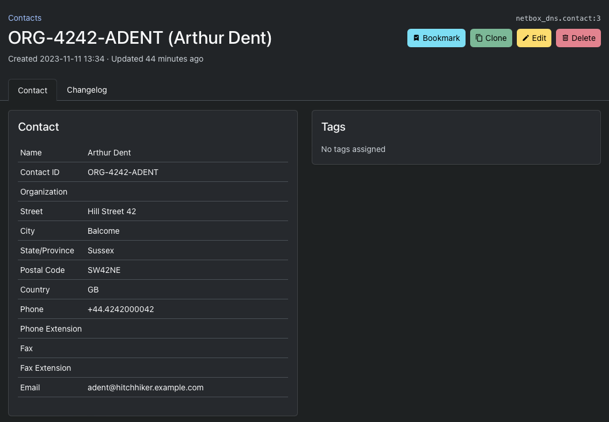
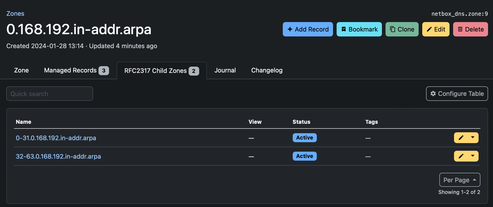
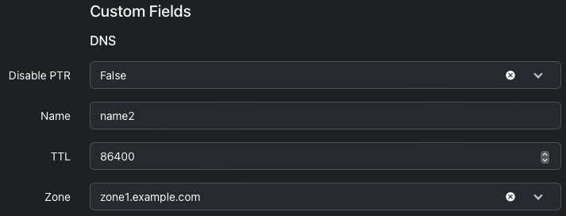
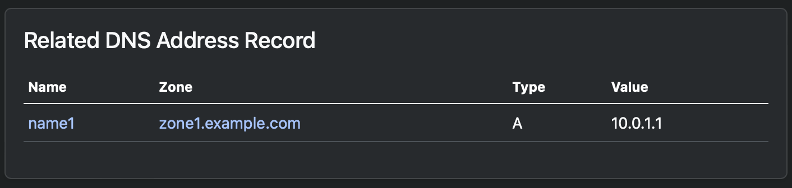

# NetBox DNS
The NetBox DNS plugin enables NetBox to manage operational DNS data such as name servers, zones, records and views, as well as registration data for domains. It can automate tasks like creating PTR records, generating zone serial numbers, NS and SOA records, as well as validate names and values values for resource records to ensure zone data is consistent, up-to-date and compliant with to the relevant RFCs.

## Objectives
NetBox DNS is designed to be the 'DNS Source of Truth' analogous to NetBox being the 'Network Source of Truth'.

The plugin stores information about DNS name servers, DNS views and zones, and DNS records, making it a data source for automatic provisioning of DNS instances. Registration information about DNS registrars and contacts for DNS domains can also be stored and associated with zones.

The main focus of the plugin is to ensure the quality of the data stored in it. To achieve this, there are many validation and automation mechanisms in place:

* Validation of record names and values
* Automatic maintenance of PTR records for IPv6 and IPv4 address records
* Automatic generation of SOA records, optionally including the serial number of the zone data
* Validation of changs to the SOA SERIAL number, whether they are done automatically or manually
* Validation of record types such as CNAME and singletons, to ensure DNS zone validity
* Support for [RFC 2317](https://datatracker.ietf.org/doc/html/rfc2317) delegation of PTR zones for IPv4 subnets longer than 24 bits

Other main features include:

* Support for BIND views, providing lightweight namespaces for zones
* Support for IDN, including the validation of punycode names
* Full support for the NetBox REST and GraphQL APIs
* Support for all major NetBox features such as global search, tenancy, change logs, tagging, journaling etc.

## Non-objectives
In the same way as NetBox is not a network management application, NetBox DNS does not provide any functionality to manage specific name servers or DNS service providers or to generate input such as configuration and zone files for them. The focus is on the completeness and integrity of the data needed to run DNS zones, not on the peculiarities of a plethora of servers and services that actually use the data. This functionality is left to specialized integration tools, or in many cases it can be easily implemented using Ansible or similar tools based on NetBox DNS data. Example code for some simple use cases is provided.

For integration with a large number of DNS server implementations integration tools like [octodns-netbox-dns](https://pypi.org/project/octodns-netbox-dns/) are available.

## Installation and Configuration
The installation of plugins in general is described in the [NetBox documentation](https://netbox.readthedocs.io/en/stable/plugins/).

### Requirements
The installation of NetBox DNS requires a Python interpreter and a working NetBox deployment. The following versions are currently supported:

* NetBox 4.0.0 or higher
* Python 3.10 or higher

### Compatibility
NetBox DNS is compatible with the following NetBox versions.

NetBox Version | NetBox DNS Version | Comment
-------------- | ------------------ | -------
3.0.x - 3.4.x  | -                  | No support
3.5.x          | 0.22.x or earlier  | Only NetBox DNS 0.22.x is supported
3.6.x          | 0.22.x or earlier  | Only NetBox DNS 0.22.x is supported
3.7.x          | 0.22.x or earlier  | Only NetBox DNS 0.22.x is supported
4.0.x          | 1.0.x or later     | Only the latest NetBox DNS version is supported

For earlier version of NetBox, please use the old version of the PyPI module `netbox-dns`.  Please be aware that this version is no longer supported and will not receive any further updates. We therefore strongly recommend that you move to at least NetBox 3.5 and use the latest supported version of NetBox DNS.

### Installation of NetBox DNS
NetBox DNS is available as a PyPi module and can be installed using pip:

```
$ source /opt/netbox/venv/bin/activate
(venv) $ pip install netbox-plugin-dns
```
This will install NetBox DNS and all prerequisites within the NetBox virtual environment.

### Adding NetBox DNS to the local NetBox requirements
To ensure that NetBox DNS is updated when a NetBox update is performed,  include it in the local requirements file for NetBox:

```
echo netbox-plugin-dns >> /opt/netbox/local_requirements.txt
```
If the local requirements file does not exist, this command will create it.

This will guarantee that NetBox DNS will be updated every time the update script provided with NetBox is executed.

### Enabling the Plugin

In configuration.py, add `netbox_dns` to the PLUGINS list:

```
PLUGINS = [
    'netbox_dns',
]
```

### Running the Django database migration procedure
NetBox DNS requires some tables for its data models within the NetBox database to be present. Execute the following command to create and update these tables:

```
/opt/netbox/netbox/manage.py migrate
```

### Restarting NetBox
Restart the WSGI service and the request queue worker to load the new plugin:

```
systemctl restart netbox netbox-rq
```
Now NetBox DNS should show up under "Plugins" at the bottom of the left-hand side of the NetBox web GUI.

### Reindexing Global Search
In order for existing NetBox DNS objects to appear in the global search after the initial installation or some upgrades of NetBox DNS, the search indices need to be rebuilt. This can be done with the command

```
/opt/netbox/netbox/manage.py reindex --lazy netbox_dns
```
This can be done at any time, especially when items that should show up in the global search do not.

### Upgrading NetBox DNS from `netbox-dns` to `netbox-plugin-dns`
The current Python module for NetBox DNS is named `netbox-plugin-dns`. Until March 2023, the module providing the NetBox DNS plugin was named `netbox-dns`, and this PyPI module can unfortunately still be installed. It has not received any updates since the switch to `netbox-plugin-dns` was necessary, is no longer supported and does not work with NetBox versions 3.5.0 and higher.

#### `netbox-dns` versions less than 0.16.0
If the old `netbox-dns` module is installed on the system, please ensure that it is upgraded to the latest version before running the migration.

```
/opt/netbox/venv/bin/python3 -m pip install --upgrade netbox-dns
/opt/netbox/netbox/manage.py migrate
```
This will install the latest version 0.17.0 of the plugin and perform the necessary database migrations that are required for the migration to `netbox-plugin-dns`. Then proceed as described in the next section.

#### `netbox-dns` version 0.16.0 and higher
If the version of `netbox-dns` is at least 0.16.0, the system can be directly migrated to `netbox-plugin-dns`. It is vital that the old plugin is removed before the new one is installed, otherwise NetBox will fail to start.

```
/opt/netbox/venv/bin/python3 -m pip remove netbox-dns
/opt/netbox/venv/bin/python3 -m pip install netbox-plugin-dns
/opt/netbox/netbox/manage.py migrate
```

### NetBox 3 support
NetBox 3.5.0 up to NetBox 3.7.x are not supported by the latest version of NetBox DNS. In order to install NetBox DNS on NetBox 3 systems, please install the latest version of `netbox-plugin-dns` 0.22:

```
/opt/netbox/venv/bin/python3 -m pip install 'netbox-plugin-dns<0.23'
/opt/netbox/netbox/manage.py migrate
```

## Object types
Currently NetBox DNS can manage six different object types: Views, Name Servers, Zones, and Records, Contacts and Registrars.

### Views
Views are a concept that allows the DNS namespace to be partitioned into groups of zones that are isolated from each other. They are mainly used in split horizon DNS setups, for example in cases where there is a different DNS resolution requirement for external and internal clients, where external clients do not get the same set of names, or see different IP addresses than internal clients in case of NAT setups. Other scenarios are possible as well.

Each zone is associated with a view. There is a default view, initially named `_default_`, which is assigned automatically to all zones that don't specify an explicit view. The default view can be renamed at the discretion of the user, provided the view name is unique. Other views can be added as needed. If there is only the default view, no special action is required.

* Zone names do not need to be unique, provided the zones with identical names are not in the same view
* When a PTR record is created for an A or AAAA record, the record is created within a reverse zone that is in the same view

Views only affect zones (and consequently records within them), not name servers.

Views that have zones associated with them cannot be deleted, as this would result in a high risk of major data loss. If a view is to be deleted, move all zones from the view to a different one or remove the view from the zones and delete it afterwards. The default view cannot be deleted in any case, just renamed. To delete the default view, designate a different view to be the default view and then delete the former default view.

When a zone is moved from one view to a different one, NetBox DNS checks for conflicting zone names and PTR records and refuses to perform the action. In this case, manual intervention is required.

A view detail view:


If the view is used by any zones, there is an additional tab listing the zones that use the view.


Additonally there is another tab showing the change log for the view.


#### Permissions
The following Django permissions are applicable to View objects:

Permission               | Action
----------               | ------
`netbox_dns.add_view`    | Create new view objects
`netbox_dns.change_view` | Edit view information
`netbox_dns.delete_view` | Delete a name server object
`netbox_dns.view_view`   | View name server information

To use tags, the `extras.view_tag` permission is required as well.

#### Fields
The following fields are defined for views:

Field            | Required | Explanation
-----            | -------- | -----------
**Name**         | Yes      | The name of the view
**Default View** | Yes      | The view is the default view. This flag is set for exactly one view, setting it for a different view removes it from the former default view
**Description**  | No       | A short textual description of the view
**Tags**         | No       | NetBox tags assigned to the view. Tags can be used to categorise views by arbitrary criteria such as Production/Test/Development systems
**Tenant**       | No       | The tenant the view is assined to

### Name servers
Name server objects correspond to name servers in the DNS infrastructure and are basically fully qualified domain names (FQDN) of hosts running name server instances.

A Name Server object is required for a zone's MNAME field in the SOA record, defining the primary server for the zone data, and for NS records inside each zone, defining the name servers that are serving as data sources for a zone's authoritative information. The primary name server is not necessarily one of the authoritative name servers.

Without any name servers in the system, zones cannot be defined as a name server object is strictly required for the SOA MNAME field. Therefore, at least one name server must be defined before adding zones or records to NetBox DNS.

Optionally, name servers can be tagged using standard NetBox tags. Tags must be defined in NetBox before they can be assigned to any object.

Name servers that are in use by zones for their SOA MNAME field cannot be deleted.

#### Permissions
The following Django permissions are applicable to Name Server objects:

Permission                     | Action
----------                     | ------
`netbox_dns.add_nameserver`    | Create new name server objects
`netbox_dns.change_nameserver` | Edit name server information
`netbox_dns.delete_nameserver` | Delete a name server object
`netbox_dns.view_nameserver`   | View name server information

To use tags, the `extras.view_tag` permission is required as well.

#### Fields
For name servers the following fields are defined:

Field           | Required | Explanation
-----           | -------- | -----------
**Name**        | Yes      | The fully qualified domain name (FQDN) of the name server
**Description** | No       | A short textual description of the name server
**Tags**        | No       | NetBox tags assigned to the name server. Tags can be used to categorise name servers by arbitrary criteria such as Production/Test/Development systems
**Tenant**      | No       | The tenant the name server is assined to

A name server detail view:


If the name server is used as an authoritative name server for any zones, there is an additional tab listing the zones that use it.


Similarly, if the name server is listed as the primary nameserver for zones in their SOA MNAME field, there is another tab listing those zones.


As with views, another tab lists the change log entries for the name server.

### Zones
Zone objects correspond to DNS zones to be served. Each zone contains resource records (RRs) of various types and zone-specific configuration information that affects how the zone data is propagated and cached.

#### Permissions
The following Django permissions are applicable to Name Server objects:

Permission               | Action
----------               | ------
`netbox_dns.add_zone`    | Create new zone objects
`netbox_dns.change_zone` | Edit zone information
`netbox_dns.delete_zone` | Delete a zone object
`netbox_dns.view_zone`   | View zone information

To use tags, the `extras.view_tag` permission is required as well.

#### Generic Fields
The following fields are defined for every zone object:

Field           | Required | Default  | Explanation
-----           | -------- | -------  | -----------
**Name**        | Yes      |          | The name of the zone. This is an FQDN that represents the DNS domain containing host names to be resolved or one of the special zones `in-addr.arpa` or `ip6.arpa`, which are reserved for the resolution of IPv4 and IPv6 addresses by the DNS infrastructure
**View**        | No       |          | The name of the view the zone is associated with. If the view is not the default view, the zone name is also prefixed with the view name in brackets to make zones easier to distinguish in lists.
**Status**      | Yes      | Active   | The zone's status. Possible values are "active", "reserved", "deprecated" or "parked". All zone status except "Active" are considered inactive, which has implications for the records in a zone as well as for PTR records in reverse zones that are automatically generated for address records in the zone
**Nameservers** | No       | see [Default Settings](#zone_defaults) | The list of authoritative name servers for the zone
**Default TTL** | Yes      | see [Default Settings](#zone_defaults) | The default TTL for all records in the zone if none is specified
**Description** | No       |          | A short textual description of the zone
**Tags**        | No       |          | NetBox tags assigned to the zone. Tags can be used to categorise zones by arbitrary criteria
**Tenant**      | No       |          | The tenant the zone is assigned to

##### Zones without name servers

While the "Nameservers" list for a zone is not strictly required, zones without any name server records cannot be loaded by DNS servers. The detail view of a zone without any name servers displays an error message to inform users of this fact.


This will make zone data exported from NetBox DNS unusable unless name servers are added before trying to load that zone.

##### Zones with unresolved name servers

Similarly, if a zone has nameservers defined, the name servers have domain names within a zone managed by NetBox DNS, and the name of the name server cannot be resolved within that zone, a warning message will be displayed in the zone detail view for every name server affected.


This will result in the secondary name servers being unable to be notified of zone updates, although the zone data itself is generally valid.

#### SOA fields
Zone specific data is maintained in the zone's "Start of Authority" (SOA) record. That record contains the following fields in the specified order:

SOA Field     | Explanation
---------     | -----------
**TTL**       | The time to live for the SOA record.
**MNAME**     | The FQDN of the primary name server for the zone
**RNAME**     | The mailbox of the person responsible for the zone. Note that the "@" in the e-mail address used here has to be replaced by a dot ".".
**SERIAL**    | An unsigned 32 bit number indicating the current state of the zone on the primary name server
**REFRESH**   | A 32 bit time interval in seconds that indicates the interval after which the zone should be refreshed from the upstream name server
**RETRY**     | A 32 bit time interval in seconds that indicates how long a name server should wait before retrying a failed refresh attempt
**EXPIRE**    | A 32 bit time interval in seconds that indicates the duration after which a zone that cannot be refreshed is no longer authoritative
**MINIMUM**   | A 32 bit time interval in seconds that is to be used as the default time to live (TTL) for records served from the zone. Note that this affects both positive and negative (NXRRSET) lookups

The zone's SOA record is assembled from these fields by concatenating them and putting them in parentheses. NetBox DNS automatically creates the SOA record  from the information entered in the fields above.

All SOA fields are required. Default settings can be configured in the Django configuration file, see [Zone Default Settings](#zone_defaults)).

#### Domain Registration Fields
For zones that are registered as public DNS domains, there is a third set of fields available that reflects the domain's registration data.

Field                      | Required | Explanation
---------                  | -------- | -----------
**Registry**               | No       | The registry used to register the domain
**Registry Domain ID**     | No       | The domain ID assigned by the registry on registration
**Registrant**             | No       | The owner of the domain
**Administrative Contact** | No       | The administrative contact for the domain
**Technical Contact**      | No       | The technical contact for the domain
**Billing Contact**        | No       | The billing contact for the domain

All fields are optional.

If there is registration information for a zone, the zone's detail view contains an additional 'Registration' tab showing that information.


### Automatic SOA SERIAL generation
SOA SERIAL fields are crucial for the propagation of zone data from primary name servers to secondaries, as the process involves checking the zone's serial number on the secondary against the serial number on the primary and only performing the update when the primary has a higher serial number or the interval specified in the SOA EXPIRE field has passed.

This is particularly relevant when PTR records are automatically created from A and AAAA records and an update to a forward zone thus can result in one or several reverse zones being updated in the background as well.

For that reason, NetBox DNS offers the option of automatically creating SOA serial numbers when zones or records within them change. This is controlled by the `Generate SOA Serial` checkbox in the zone create and edit views. If that check box is ticked, the serial number of the zone is calculated as maximum of the Unix epoch times (seconds since January 1st, 1970 00:00 UTC) of the last change to any records and the zone itself.

If the checkbox is not selected, the SERIAL field is mandatory and the user is responsible for keeping track of zone changes. NetBox DNS will not touch the serial number of that zone in any case.

A zone in detail view:


If there are records in the zone, a second tab shows a list of these records.


Another tab displays all managed records in the zone. Since at the very least there is the SOA record, this tab is always visible. Note that managed records cannot be edited, so there are no 'edit' and 'delete' buttons for records in the managed records tab.


### <a name="zone_defaults"></a>Zone Default settings
The default settings for the Zone can be configured in the plugin configuration of NetBox. The following settings are available:

Setting                 | Variable               | Factory Default
-------                 | --------               | ---------------
**Nameservers**         | `zone_nameservers`     |
**Default TTL**         | `zone_default_ttl`     | 86400
**SOA MNAME**           | `zone_soa_mname`       |
**SOA RNAME**           | `zone_soa_rname`       |
**SOA SERIAL**          | `zone_soa_serial`      | 1
**SOA REFRESH**         | `zone_soa_refresh`     | 43200
**SOA RETRY**           | `zone_soa_retry`       | 7200
**SOA EXPIRE**          | `zone_soa_expire`      | 2419200
**SOA MINIMUM**         | `zone_soa_minimum`     | 3600

The settings can be set or overridden in the file `/opt/netbox/netbox/netbox/configuration.py` by defining new values in `PLUGINS_CONFIG` as follows:

```
PLUGINS_CONFIG = {
    'netbox_dns': {
        'zone_nameservers': ['ns1.example.com', 'ns2.example.com'],
        'zone_soa_mname': 'ns1.example.com',
        'zone_soa_rname': 'hostmaster.example.com',
    },
}
```

The default value for 'Generate SOA Serial' (`soa_serial_auto`) is `True` and cannot be modified via the zone default settings. The default setting for SOA SERIAL (`soa_serial`) is only applied if the automatic generation of SOA serial numbers is disabled. The list of default nameservers is only observed when new zones are created or imported via the GUI, not when `Zone` objects are created using scripts.

After changing the configuration, NetBox must be restarted for the changes to take effect.

### Records
Record objects correspond to resource records (RR) that within zones. NetBox DNS differentiates between records maintained by the user and so-called 'managed records', which are created by NetBox DNS itself and cannot be edited manually. Currently there are three types of managed records:

* SOA records are created from the SOA data for a zone
* NS records are created from the name servers assigned to a zone
* PTR records are created in reverse zones (zones ending `in-addr.arpa` or `ip6.arpa`) from address records in other zones.

There is exactly one SOA record per zone, so SOA records cannot be created manually at all. NS and PTR records do not have that kind of restriction and can be created and maintained manually if they have not been created by NetBox ('managed records'), although that should also be required in special cases.

#### Permissions
The following Django permissions are applicable to NameServer objects:

Permission                 | Action
----------                 | ------
`netbox_dns.add_record`    | Create new record objects
`netbox_dns.change_record` | Edit record information
`netbox_dns.delete_record` | Delete a record object
`netbox_dns.view_record`   | View record information

To use tags, the `extras.view_tag` permission is required as well.

#### Fields
For records the following fields are defined:

Field           | Required | Explanation
-----           | -------- | -----------
**Zone**        | Yes      | The zone in which the record is to be defined
**Type**        | Yes      | The type of the resource record. This can be one of a list of record types derived from [RFC 1035, Section 3.3](https://datatracker.ietf.org/doc/html/rfc1035#section-3.3), e.g. A or AAAA
**Disable PTR** | Yes      | A checkbox indicating whether a PTR record should be generated for an A or AAAA record automatically if there is a zone suitable for the PTR in NetBox DNS
**Name**        | Yes      | The name of the record, e.g. the simple host name for A and AAAA records
**Value**       | Yes      | The value of the record, e.g. the IPv4 or IPv6 addreess
**Status**      | No       | The status of a record. Pre-defined choices are "Active" (which is the default) and "Inactive"
**TTL**         | No       | The time to live for the record. If empty, the zone's SOA MINIMUM value or an explicitly defined zone default TTL value ($TTL in the master zone file) will be used. See [RFC 2308, Section 4](https://datatracker.ietf.org/doc/html/rfc2308#section-4)
**Description** | No       | A short textual description of the record
**Tags**        | No       | NetBox tags assigned to the name server. Tags can be used to categorise name servers by arbitrary criteria such as Production/Test/Development systems
**Active**      | N/A      | This field is not an input field, but it is created from the zone and record status. A record is marked inactive when either the zone that contains it or the record itself is not in an active status. **No PTR records are created for inactive A or AAAA records**

#### Automatic generation of PTR records
NetBox DNS can automatically generate and maintain the corresponding PTR records for the address record types A and AAAA. To achieve this, the following conditions must be met:

* The corresponding `in-addr.arpa` or `ip6.arpa` zone must be present in NetBox DNS
* The "Disable PTR" field must not be set to False (default is True)
* The address record and the zone containing it are in an active state

If, for instance, there is a zone `0.0.10.in-addr.arpa` is defined in NetBox DNS and an address record is created in the forward zone `example.com` with the address `10.0.0.1`, the corresponding PTR record will be created in the former zone as the reverse RR name for the IPv4 address `10.0.0.1` is `1.0.0.10.in-addr.arpa`.

When an A record is created for which a PTR record is not necessary or desired, the "Disable PTR" option can be used to prevent the creation of the corresponding PTR record even if a reverse zone matching the address exists.

If the reverse zone does not exist in NetBox DNS, it will not be created automatically as it is not certain that the authority for that zone lies with the user. However, should a matching reverse zone be created at a later date, the PTR records for all active A or AAAA records in NetBox DNS that match the new reverse zone will be created automatically (unless "Disable PTR" is set for a record).

Should the name and/or value of an A record be changed, this will result in the corresponding PTR record being updated, moved or deleted. Similarly, should an A record be deleted, the corresponding PTR record will also be deleted.

A record detail view for a standard record:


A record detail view for a managed record:


Note that for managed records there are no buttons for deleting, editing or cloning them as they cannot be managed manually. Otherwise they are handled  in the same way as standard records.

#### Displaying records
Records can either be displayed by opening the record list view from the "Records" or "Managed Records" navigation item on the left, or per zone via the respective tabs in the zone defail view. In any case, the tables can be filtered by name, value, zone, or tags to narrow down the set of records displayed.

### Registrars
Registrar objects relate to the DNS domain registration and represent the registrar information for DNS domains related to zones. A DNS zone does not necessarily need to be registered: Zones that are not available via public DNS or that are sub-zones of registered zones do not require registration. In most cases registration information is only required (and possible) for second-level domains.

Registrar objects relate to the registration institutions responsible for registering domains with the TLD registries. A list of accredited registrars is available on the [ICANN website](https://www.icann.org/en/accredited-registrars).

#### Permissions
The following Django permissions are applicable to Registrar objects:

Permission                    | Action
----------                    | ------
`netbox_dns.add_registrar`    | Create new registrar objects
`netbox_dns.change_registrar` | Edit registrar information
`netbox_dns.delete_registrar` | Delete a registrar object
`netbox_dns.view_registrar`   | View registrar information

To use tags, the `extras.view_tag` permission is required as well.

#### Fields
The following fields are defined for registrars:

Field             | Required | Explanation
-----             | -------- | -----------
**Name**          | Yes      | A unique name for the registrar
**IANA ID**       | No       | A numeric ID assigned by the IANA on accredtiation of the registrar
**Referral URL**  | No       | The URL of the registrar's web presence
**WHOIS Server**  | No       | The WHOIS server for the registrar
**Abuse Email**   | No       | The Email address used to report abuse cases for a domain
**Abuse Phone**   | No       | The phone number used to report abuse cases for a domain

The fields are closely related to the WHOIS fields for the registrar for a domain. More information can be found on the [ICANN web site](https://www.icann.org/resources/pages/rdds-labeling-policy-2017-02-01-en)

#### Displaying Registrars
A registrar in detail view:


If there are zones registered for the registrar, a second tab shows a list of these zones.


### Contacts

#### Permissions
The following Django permissions are applicable to Contact objects:

Permission                  | Action
----------                  | ------
`netbox_dns.add_contact`    | Create new contact objects
`netbox_dns.change_contact` | Edit contact information
`netbox_dns.delete_contact` | Delete a contact object
`netbox_dns.view_contact`   | View contact information

To use tags, the `extras.view_tag` permission is required as well.

#### Fields
The following fields are defined for contacts:

Field               | Required | Explanation
-----               | -------- | -----------
**Name**            | No       | A name for the contact. The name is not necessarily unique, because the same person might have many DNS contacts, sometimes also called 'handles'.
**Contact ID**      | Yes      | A unique ID, usually assigned by the Registrar, that identifies the person or organisation.
**Organization**    | No       | An organization the contact is associated with
**Street**          | No       | The street of the contact's address
**City**            | No       | The city of the contact's address
**State/Province**  | No       | The state or province the contact is located in
**Postal Code**     | No       | The postal code of the contact's address
**Country**         | No       | The ISO3166 country code of the contact's address
**Phone**           | No       | The phone number of the contact
**Phone Extension** | No       | The phone extension of the contact
**Fax**             | No       | The fax number of the contact
**Fax Extension**   | No       | The fax extension of the contact
**Email**           | No       | The Email address of the contact

The fields are closely related to the WHOIS fields for the registrant, admin contact, tech contact and billing contact for a domain. More information can be found on the [ICANN web site](https://www.icann.org/resources/pages/rdds-labeling-policy-2017-02-01-en)

#### Displaying Contacts
A contact in detail view:



If there are zones registered for the contact, a second tab shows a list of these zones.


## Name validation
The names of DNS Resource Records are subject to a number of RFCs, most notably [RFC1035, Section 2.3.1](https://www.rfc-editor.org/rfc/rfc1035#section-2.3.1), [RFC2181, Section 11](https://www.rfc-editor.org/rfc/rfc2181#section-11) and [RFC5891, Section 4.2.3](https://www.rfc-editor.org/rfc/rfc5891#section-4.2.3). Although the specifications in the RFCs, especially in RFC2181, are rather permissive, most DNS servers enforce them and refuse to load zones containing non-conforming names. NetBox DNS validates RR names before saving records and refuses to accept records not adhering to the standards.

The names of Name Servers, Zones and Records are all used as RR names in DNS, so all of these are validated for conformity to the aforementioned RFCs. When a name does not comply with the RFC rules, NetBox DNS refuses to save the name server, zone or record with an error message indicating the reason for the refusal.

**Please be aware that unlike names, values are not validated. While this is theoretically possible and may be implemented at some point, it is not a trivial task as there is a plethora of RR types with even more value formats.**


### Validation options

There are some special cases that need to be taken care of:

* Some non-free operating systems accept underscores in host names, which are not permitted according to RFC1035 and rejected by default e.g. by BIND.
* Record types such as SRV and TXT can contain underscores as the first character of a label even in more standard-conforming implementations
* Given the large number of defined RR types, there might be other exceptions to the rules given in the RFCs

To take care of these cases, there are three configuration variables for NetBox DNS that adjust the validation of record names:

* `tolerate_underscores_in_labels` can be set to allow the use of undercores in host names. Underscores are normally only permitted in certain record types such as SRV, not in normal host names, but at least one operating system's DNS implementation does not follow the standard and allows this.
* `tolerate_characters_in_zone_labels` is a string consisting of characters that are to be allowed in zone labels in addition to the standard characters. This can be used to allow zone names like `0/25.2.0.192.in-addr.arpa` from the RFC2317 examples. Allowing special characters can lead to unexpected results with zone provisioning tools and to zones not loadable by some or all DNS server implementations, so use this option with extreme caution.
* `tolerate_leading_underscore_types` contains a list of RR types that allow an underscore as the first character in a label.
* `tolerate_non_rfc1035_types` contains a list of record types that allow characters outside the set defined in RFC1035 to be used in RR names. Record types in this list are exempt from validation.

#### <a name="validation_defaults"></a>Name validation default settings

Variable                            | Factory Default
--------                            | ---------------
`tolerate_underscores_in_labels`    | `False`
`tolerate_characters_in_zone_labels`| `''`
`tolerate_leading_underscore_types` | `["TXT", "SRV"]`
`tolerate_non_rfc1035_types`        | `[]`

The settings can be set or overridden in the file `/opt/netbox/netbox/netbox/configuration.py` by defining new values in `PLUGINS_CONFIG` as follows:

```
PLUGINS_CONFIG = {
    'netbox_dns': {
        ...
        'tolerate_underscores_in_labels': True,
        'tolerate_characters_in_zone_labels': "/",
        'tolerate_leading_underscore_types': ["TXT", "SRV", "CNAME"]
        'tolerate_non_rfc1035_types': ["X25"]
    },
}
```

## SOA SERIAL validation
The SOA SERIAL field contains a serial number of a zone that is used to control if and when DNS slave servers load zone updates from their master servers. Basically, a slave server checks for the SOA SERIAL of a zone on the master server and only transfers the zone if that number is higher than the one it has in its own cached data. This does not depend on whether the transfer has been triggered by the upstream server via `NOTIFY` or whether it is scheduled by the slave because the SOA REFRESH time has elapsed.

SOA SERIAL numbers use integer arithmetic modulo 2^32, i.e. they wrap back to zero at 4.294.967.296. As a general rule, a serial number must never decrease (as this would keep the slaves from updating the zone). Any advancement by less than 2**31 (2.147.483.648) is considered an increase, 2.147.483.648 or more would mean a decrease in that logic and hence it is not a permitted change.

Starting from version 1.0.1, NetBox DNS does not allow the serial number to decrease and presents an error message if the user tries to perform an action that would lead to a lower than before serial number:


A special case occurs when a zone is switched from static serial numbers to automatically generated serial numbers. As one of the common schemes for manually generated serial numbers is to use a date-based numbeing like `YYYYMMDDxx`, which results in integer values above 2000000000, and automatic SOA SERIAL generation uses the epoch, which currently results in values below that, switching to automatic generation is not trivially possible:


In this case, the serial number must first be adjusted manually so that the automatically generated serials are higher than the last value present on the slaves. See [RFC 2182, Section 7](https://datatracker.ietf.org/doc/html/rfc2182#section-7) for details on how to proceed.


## International Domain Names (IDNs)

NetBox DNS supports International Domain Names (IDNs) in resource records. IDNs are domain names containing Unicode characters such as special characters in Latin scripts (e.g. 'ä', 'ö', 'ü', 'ç', 'å'), non-Latin scripts such as Arabic, Kyrillian or Kanji, or even Emoji. Since DNS does not support any of these, [RFC3492](https://www.rfc-editor.org/rfc/rfc3492) defines a mapping to so-called 'Punycode' that allows to translate between the limited character set supported by DNS and Unicode.

For instance, the IDN `exämple.com` is represented in Punycode as `xn--exmple-cua.com`, and `👁🐝m.com` as `xn--m-w22scd.com`. The Punycode representation of these names conforms to the validation rules enforced by NetBox DNS name validation. Since the Punycode representation cannot be parsed by most humans, NetBox DNS displays and accepts the Unicode representation where it is possible and necessary.


Internally, all IDNs are handled in a normalised form as Punycode. This ensures that the data coming from NetBox DNS can be handled by any tool and easily exported to name servers without any need for conversion to the standard format.

## Root Zones

NetBox DNS provides experimental support for managing root zones. Root zones are usually maintained by the ICANN, but there are special cases in which it may make sense to use internal root name servers. Normally the root zone, designated by the name `.`, cannot be used in NetBox DNS as the name fails validation, but if necessary this can be enabled by setting the configuration flag `enable_root_zones` in the file `/opt/netbox/netbox/netbox/configuration.py` as follows:

```
PLUGINS_CONFIG = {
    'netbox_dns': {
        ...
        'enable_root_zones': True,
        ...
    },
}
```

This feature is disabled by default.

## Uniqueness of Records

There is no standard requiring that records within a zone must be unique. Therefore, it is permissible to create records with the same name, type and value to a zone where the same record already exists. However, in the majority of cases, this is not a sensible approach and is not aligned with expectations. There are very few use cases for this approach. On the other hand, allowing duplicate records can cause problems with bulk imports and automated updates to zones.

For this reason NetBox DNS enforces uniqueness of records by default in a way that no record can be created with a given name, type and value in a zone where an active record with the same values already exists. This enforcement can be disabled by setting the configuration variable `enforce_unique_records` to `False`:

```
PLUGINS_CONFIG = {
    'netbox_dns': {
        ...
        'enforce_unique_records': False,
        ...
    },
}
```

Please note that setting this option to `True` in an existing NetBox installation or updating NetBox to a later version that enforces this behaviour does not affect duplicate records that are already present in the database, and so it might make sense to clean them up manually or by script. It will not be possible to save any changes to either of the duplicate records as long as the other one is still present and active.

## Uniqueness of TTLs across RRSets
[RFC2181, Section 5.2](https://www.rfc-editor.org/rfc/rfc2181#section-5.2) specifies that having different TTL values for resource records in RRSets, i.e. sets of records that have the same name, zone and type, is deprecated.

NetBox DNS by default enforces this restriction, which can be disabled by setting the configuration variable `enforce_unique_rrset_ttl` to `False`:

```
PLUGINS_CONFIG = {
    'netbox_dns': {
        ...
        'enforce_unique_rrset_ttl': False,
        ...
    },
}
```

If `enforce_unique_rrset_ttl` is set to `True`, new records with the same name, zone and type but a different TTL value cannot be created. It is possible to change the TTL for records that are part of an RRSet, but when the TTL is changed for one record, it will automatically be changed for the other records in the RRSet as well.

### Updating existing RRSets
In the event that there are already RRSets in the NetBox DNS database with inconsistent TTL values, these can be cleaned up using the following management command:

```
(netbox) [root@dns netbox]# /opt/netbox/netbox/manage.py cleanup_rrset_ttl
RRSet cleanup completed.
```

This modifies the TTL value for all records included in an RRSet to either the minimum or the maximum TTL value for all records in the RRSet. This can be specified by using either the `--min` or the `--max` option for the command. The default is to use the minimum TTL value.

## Tenancy

With NetBox DNS 0.19.0 support for the NetBox tenancy feature was added. It is possible to assign all NetBox DNS objects with the exception of managed records to a tenant, making it easier to filter DNS resources by criteria like their assignment to a customer or department.

Tenancy does not have any impact on uniqueness constraints within NetBox DNS.

The NetBox detail view for tenants shows a tenants in the list of objects on the right hand side.


The columns of the table on the left side are clickable and link to filtered lists showing the related views, nameservers, zones and records.

## RFC 2317
RFC 2317 provides a solution to the issue of delegation of reverse zones for IPv4 subnets with a longer network mask than /24, which is not possible using the classical `in-addr.arpa` zone hierarchy.

The solution works is to define specific zones that hold the PTR records for such a subnet, and then insert CNAME records for these PTR records in the `in-addr.arpa` zone containing it. NetBox DNS release 0.22.0 and later support creating these RFC2317 zones and the automatic insertion of PTR records within them and, optionally, CNAME records in the containing `in-addr.arpa` zone that point to the PTR records.

### Designating a Zone as an RFC2317 Zone


The 'RFC2317 Prefix' specifies an IPv4 prefix with a network mask length of 25 or longer. If an address record is created for an address in this prefix, the PTR record will be created in the zone the prefix has been specified for.

If the checkbox labelled 'RFC2317 Parent Managed' is selected and there is an `in-addr.arpa` zone corresponding to a subnet containing the RFC2317 Subnet, a CNAME record pointing in that zone will be created automatically when a PTR record is created in the RFC2317 zone. If the checkbox is unchecked, it is assumed that the reverse zone for the parent prefix is not managed within NetBox DNS. In this instance, the responsibility for creating the CNAMEs falls upon the authority responsible for the parent zone.

If the zone name is selected in a way that makes the zone is a sub-zone of the corresponding `in-addr.arpa` zone such as `32-63.0.168.192.in-addr.arpa`, the parent zone must delegate the zone to the name servers responsible for it if the authoritative name servers are not the same.

### RFC2317 Zones and Managed Parent

If an RFC2317 zone has a managed parent zone in NetBox DNS, the detail view of the RFC2317 zone has a link to the parent zone.


The parent zone, on the other hand, has a tab showing all RFC2317 child zones.



### RFC2317 CNAME Record Detail View

For CNAME records created in RFC2317 parent zones, the detail view shows the A and PTR record(s) the RFC2317 CNAME record relates to in the card 'RFC2317 Targets':


### Limitations

The following limitations exist for RFC2317 zones:

* An RFC2317 prefix must have a length of 25 or longer. Shorter prefixes are not covered by RFC 2317.
* In order to enable the 'RFC2317 Parent Managed' feature, the parent reverse zone must exist.
* The RFC2317 PTR records always have a name corresponding with the host part of the address record's value in the RFC2317 subnet. Formatting the name (e.g with prefixes and suffixes) is currently not supported.
* The RFC2317 CNAME records in parent zones are created on demand when a PTR in a child zone is created. Pre-creating them on creation of an RFC2317 zone is currently not supported.
* The RFC2317 CNAME records are managed records and can not be edited manually. In normal operation this should never be necessary.

## IPAM Coupling

Starting with NetBox DNS 0.20.0, a new experimental feature that enables coupling between NetBox DNS and NetBox IPAM data is available. This feature allows users to link IP addresses in IPAM to NetBox DNS address records. The old IPAM integration feature was discontinued in favour of the new and improved functionality.

Thanks to Jean Benoît for this contribution!

### Enabling IPAM Coupling

The new experimental feature needs to be enabled in the NetBox configuration file by setting its flag:

```
PLUGINS_CONFIG = {
    'netbox_dns': {
        ...
        'feature_ipam_coupling': True,
        ...
    },
}
```

Furthermore, a number of custom fields on `ipam.IPAddress` objects are required for the feature to function correctly. These custom fields need to be created using the Django management command `setup_coupling`:

```
/opt/netbox/netbox/manage.py setup_coupling
```

In order to remove the custom fields and all related data, the same command can be used with the option `--remove`.

After these steps, a restart of NetBox is required.

### Using IPAM Coupling

The new custom fields allow for the automatic generation of a DNS address record for an IP address. To do this, define a name for the record in the 'Name' custom field and select a zone in the 'Zone' custom field in the DNS group.

It is also possible to set a TTL value for the records created via IPAM coupling, and the 'Disable PTR' option can be set as well. The 'Disable PTR' option is set to 'False' by default, which results in the creation of pointer records for address records associated with IP addresses.



Once the IP address has been saved, NetBox DNS will automatically create a managed address record for it in the selected zone, using the name from the 'Name' custom field. The 'DNS Name' field for the IP address will be set to the FQDN of the resulting address record.

If the TTL field was filled in, the TTL value for the newly created or updated address record will be set to that value.

If the 'Disable PTR' checkbox is selected, the resulting address record will have that option set as well and no pointer record will be created for the address.

The IP address is now linked to the address record in the following ways:

* When one of the custom fields for the IP address is updated, the DNS record is updated as well. This includes changing the name as well as moving it to a different DNS zone
* When the IP address is deleted, the managed DNS record is deleted as well
* When the DNS zone is renamed, the 'DNS Name' for the IP address is updated to reflect the zone's new name
* When the DNS zone is deleted, the address record is deleted and the connection from the IP address object is cleared

#### Record Status set by IPAM Coupling

The status of the address record created for an IP address depends on the status of the IP address. By default, address records for IP addresses in the statuses 'Active', 'DHCP' and 'SLAAC' are set to 'Active', while the status of the address record will be 'Inactive' in all other cases.

This mapping can be configured using the configuration variable `ipam_coupling_ip_active_status_list` in the plugin configuration. This variable contains an array of status names. The default setting for the status list is `None`, which is equivalent to

```
PLUGINS_CONFIG = {
    'netbox_dns': {
        ...
        'ipam_coupling_ip_address_status_list': [
            'active',
            'dhcp',
            'slaac',
        ],
        ...
    },
}
```

### Additional Information for IP Addresses and DNS Records

When a link between an IP address and a DNS address record is present, additional panes will appear in the IPAM IP address and NetBox DNS record view, as well as in the detail views for NetBox DNS managed records.

#### IP Address Information

If a DNS address record is linked to an IP address, the detail view for the IP address will show an additional pane displaying that address record.



If NetBox DNS also created a PTR record for the linked DNS address record, the detail view for the IP address will contain an a second additional pane showing that pointer record.


#### DNS Record Information

The detail views for the address and pointer records created for a coupled IP address include a link to that IP address, which can be used to navigate to the address.


## UI Customization

There are limited options to customize the appearance of the NetBox DNS plugin.

### Name of the Main Menu Item

The default name of the submenu NetBox DNS uses in the NetBox sidebar is 'NetBox DNS'. Using the configuration variable `menu_name` in the plugin configuration this can be changed to a different value, e.g. 'DNS':

```
PLUGINS_CONFIG = {
    'netbox_dns': {
        ...
        menu_name: "DNS",
        ...
    },
}
```

### Use a Submenu of the 'Plugins' Menu

In some cases it might be desired not to provide a main menu item for NetBox DNS but use a submenu of NetBox' standard 'Plugins' menu instead. This can be achieved by setting the configuration variable `top_level_menu` to `False` (the default value is `True`):

```
PLUGINS_CONFIG = {
    'netbox_dns': {
        ...
        top_level_menu: False``,
        ...
    },
}
```

The name of the submenu is always 'NETBOX DNS' and cannot be changed by setting `menu_name `. This is hard-coded in NetBox.
