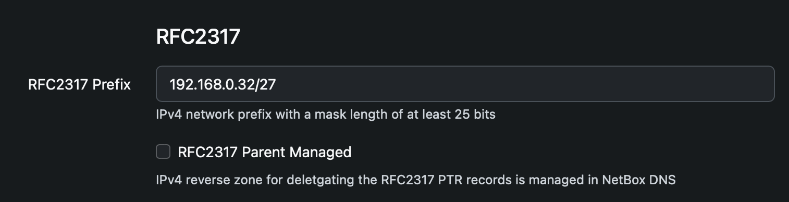
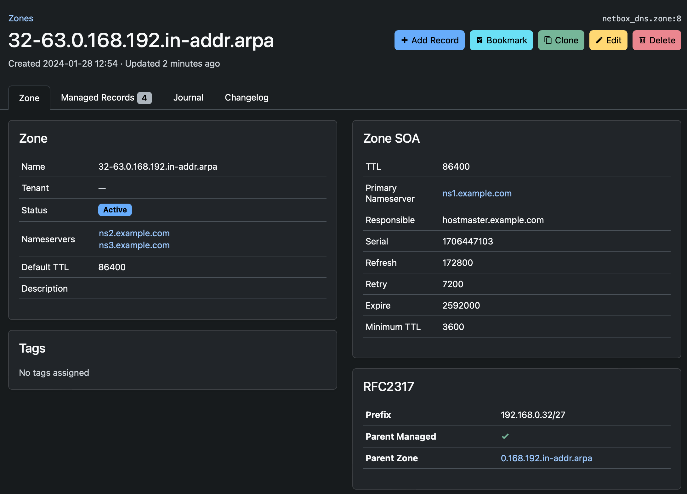

# NetBox DNS
The NetBox DNS plugin enables NetBox to manage operational DNS data such as name servers, zones, records and views, as well as registration data for domains. It can automate tasks like creating PTR records, generating zone serial numbers, NS and SOA records, as well as validate names and values values for resource records to ensure zone data is consistent, up-to-date and compliant with to the relevant RFCs.

## Objectives
NetBox DNS is designed to be the 'DNS Source of Truth' analogous to NetBox being the 'Network Source of Truth'.

The plugin stores information about DNS name servers, DNS views and zones, and DNS records, making it a data source for automatic provisioning of DNS instances. Registration information about DNS registrars and registration contacts for DNS domains can also be stored and associated with zones.

The main focus of the plugin is to ensure the quality of the data stored in it. To achieve this, there are many validation and automation mechanisms in place:

* Validation of record names and values
* Automatic maintenance of PTR records for IPv6 and IPv4 address records
* Automatic generation of SOA records, optionally including the serial number of the zone data
* Validation of changes to the SOA SERIAL number, whether they are done automatically or manually
* Validation of record types such as CNAME and singletons, to ensure DNS zone validity
* Support for [RFC 2317](https://datatracker.ietf.org/doc/html/rfc2317) delegation of PTR zones for IPv4 subnets longer than 24 bits
* Automatic creation of address records and the corresponding pointer records for IPAM IP addresses (IPAM DNSsync)

Other main features include:

* Support for BIND views, providing lightweight namespaces for zones
* Support for IDN, including the validation of punycode names
* Full support for the NetBox REST and GraphQL APIs
* Support for all major NetBox features such as global search, tenancy, change logs, tagging, journaling etc.
* Templating for zones and records enables faster creations of zones with given boilerplate object relations, such as name servers, tags, tenants or registration information, or records like standard SPF or MX records that are the same for a subset of zones.

## Non-objectives
In the same way as NetBox is not a network management application, NetBox DNS does not provide any functionality to manage specific name servers or DNS service providers or to generate input such as configuration and zone files for them. The focus is on the completeness and integrity of the data needed to run DNS zones, not on the peculiarities of a plethora of servers and services that actually use the data. This functionality is left to specialized integration tools, or in many cases it can be easily implemented using Ansible or similar tools based on NetBox DNS data. Example code for some simple use cases is provided.

For integration with a large number of DNS server implementations integration tools like [octodns-netbox-dns](https://pypi.org/project/octodns-netbox-dns/) are available.

## Installation and Configuration
The installation of plugins in general is described in the [NetBox documentation](https://netbox.readthedocs.io/en/stable/plugins/).

### Requirements
The installation of NetBox DNS requires a Python interpreter and a working NetBox deployment. The following versions are currently supported:

* NetBox 4.0.0 or higher
* Python 3.10 or higher

### Compatibility
NetBox DNS is compatible with the following NetBox versions.

NetBox Version | NetBox DNS Version | Comment
-------------- | ------------------ | -------
3.0 - 3.4      | -                  | No support
3.5            | 0.22               |
3.6            | 0.22               |
3.7            | 0.22               |
4.0 - 4.1      | 1.0                | Supports legacy IPAM Coupling
4.0 - 4.1      | 1.1                | Supports IPAM DNSsync
4.2            | 1.2                |

For earlier version of NetBox, please use the old version of the PyPI module `netbox-dns`.  Please be aware that this version is no longer supported and will not receive any further updates. We therefore strongly recommend that you move to at least NetBox 3.5 and use the latest supported version of NetBox DNS.

#### NetBox Branching Compatibility

**As a result of some issues with NetBox Branching still under investigation,
NetBox DNS is currently not compatible with the new NetBox Branching plugin.**

This affects multiple aspects of the branching functionality, and currently (`netboxlabs-branching-plugin` version 0.4.0) there is no workaround. Do not try to use NetBox Branching together with NetBox DNS until these issues are resolved.

This warning will be updated as soon as the situation is resolved.

### Installation of NetBox DNS
NetBox DNS is available as a PyPi module and can be installed using pip:

```
$ source /opt/netbox/venv/bin/activate
(venv) $ pip install netbox-plugin-dns
```
This will install NetBox DNS and all prerequisites within the NetBox virtual environment.

### Adding NetBox DNS to the local NetBox requirements
To ensure that NetBox DNS is updated when a NetBox update is performed,  include it in the local requirements file for NetBox:

```
echo netbox-plugin-dns >> /opt/netbox/local_requirements.txt
```
If the local requirements file does not exist, this command will create it.

This will guarantee that NetBox DNS will be updated every time the update script provided with NetBox is executed.

### Enabling the Plugin
In configuration.py, add `netbox_dns` to the PLUGINS list:

```
PLUGINS = [
    'netbox_dns',
]
```

### Running the Django database migration procedure
NetBox DNS requires some tables for its data models within the NetBox database to be present. Execute the following command to create and update these tables:

```
/opt/netbox/netbox/manage.py migrate
```

### Restarting NetBox
Restart the WSGI service and the request queue worker to load the new plugin:

```
systemctl restart netbox netbox-rq
```
Now NetBox DNS should show up under "Plugins" at the bottom of the left-hand side of the NetBox web GUI.

### Reindexing Global Search
In order for existing NetBox DNS objects to appear in the global search after the initial installation or some upgrades of NetBox DNS, the search indices need to be rebuilt. This can be done with the command

```
/opt/netbox/netbox/manage.py reindex netbox_dns
```
This can be done at any time, especially when items that should show up in the global search do not.

### Upgrading NetBox DNS from `netbox-dns` to `netbox-plugin-dns`
The current Python module for NetBox DNS is named `netbox-plugin-dns`. Until March 2023, the module providing the NetBox DNS plugin was named `netbox-dns`, and this PyPI module can unfortunately still be installed. It has not received any updates since the switch to `netbox-plugin-dns` was necessary, is no longer supported and does not work with NetBox versions 3.5.0 and higher.

#### `netbox-dns` versions less than 0.16.0
If the old `netbox-dns` module is installed on the system, please ensure that it is upgraded to the latest version before running the migration.

```
/opt/netbox/venv/bin/python3 -m pip install --upgrade netbox-dns
/opt/netbox/netbox/manage.py migrate
```
This will install the latest version 0.17.0 of the plugin and perform the necessary database migrations that are required for the migration to `netbox-plugin-dns`. Then proceed as described in the next section.

#### `netbox-dns` version 0.16.0 and higher
If the version of `netbox-dns` is at least 0.16.0, the system can be directly migrated to `netbox-plugin-dns`. It is vital that the old plugin is removed before the new one is installed, otherwise NetBox will fail to start.

```
/opt/netbox/venv/bin/python3 -m pip remove netbox-dns
/opt/netbox/venv/bin/python3 -m pip install netbox-plugin-dns
/opt/netbox/netbox/manage.py migrate
```

### NetBox 3 support
NetBox 3.5.0 up to NetBox 3.7.x are not supported by the latest version of NetBox DNS. In order to install NetBox DNS on NetBox 3 systems, please install the latest version of `netbox-plugin-dns` 0.22:

```
/opt/netbox/venv/bin/python3 -m pip install 'netbox-plugin-dns<0.23'
/opt/netbox/netbox/manage.py migrate
```

## Object types
Currently NetBox DNS can manage eight different object types: Views, Name Servers, Zone Templates, Zones, Record Templates, Records, Registration Contacts and Registrars.

For all fields that contain time periods (record TTL and the zone SOA timer fields, just to name a few) there is an alternative way of entering values. Instead of having to convert the desired value to seconds, NetBox DNS supports a subset of the ISO 8601 duration format starting with version 1.2.6. To specify a TTL of one day, the format "P1D" is accepted, which will be converted to 86400 before being written to the database. A time period of 15 hours is written as "PT15H" (the "T" means that the remaining part of the string represents time, not date) is interpreted as 54000. All letters have to be uppercase.

Please note that the ISO 8601 support is not complete. For example, "P4W" won't work as the only non-time-related unit supported is "D". This is a restriction of the `django.dateutil` module and will be resolved automatically if and when full ISO 8601 duration support is implemented by the Django project.

### Views
Views are a concept that allows the DNS name space to be partitioned into groups of zones that are isolated from each other. They are mainly used in split horizon DNS setups, for example in cases where there is a different DNS resolution requirement for external and internal clients, where external clients do not get the same set of names, or see different IP addresses than internal clients in case of NAT setups. Other scenarios are possible as well.

Each zone is associated with a view. There is a default view, initially named `_default_`, which is assigned automatically to all zones that don't specify an explicit view. The default view can be renamed at the discretion of the user, provided the view name is unique. Other views can be added as needed. If there is only the default view, no special action is required.

* Zone names do not need to be unique, provided the zones with identical names are not in the same view
* When a PTR record is created for an A or AAAA record, the record is created within a reverse zone that is in the same view

Views only affect zones (and consequently records within them), not name servers.

Views that have zones associated with them cannot be deleted, as this would result in a high risk of major data loss. If a view is to be deleted, move all zones from the view to a different one or remove the view from the zones and delete it afterwards. The default view cannot be deleted in any case, just renamed. To delete the default view, designate a different view to be the default view and then delete the former default view.

When a zone is moved from one view to a different one, NetBox DNS checks for conflicting zone names and PTR records and refuses to perform the action. In this case, manual intervention is required.

A view detail view:


If the view is used by any zones, there is an additional tab listing the zones that use the view.


Additonally there is another tab showing the change log for the view.


#### Permissions
The following Django permissions are applicable to View objects:

Permission               | Action
----------               | ------
`netbox_dns.add_view`    | Create new view objects
`netbox_dns.change_view` | Edit view information
`netbox_dns.delete_view` | Delete a view object
`netbox_dns.view_view`   | View view information

To use tags, the `extras.view_tag` permission is required as well.

#### Fields
The following fields are defined for views:

Field                 | Required | Explanation
-----                 | -------- | -----------
**Name**              | Yes      | The name of the view
**Default View**      | Yes      | The view is the default view. This flag is set for exactly one view, setting it for a different view removes it from the former default view
**Description**       | No       | A short textual description of the view
**IPAM Prefixes**     | No       | A list of IPAM prefixes to link to the view for IPAM DNSsync. If prefixes are assigned to a view, IPAM DNSsync will try to find a matching zone in the view if an IP Address has a DNS name assigned to it, and create an address record for that DNS name in the longest matching zone.
**IP Address Filter** | No       | A set of filter criteria for IP Address objects that determine whether or not IPAM DNSsync should create address records for it. If the field is empty, all IP Addresses will be considered for address record creation, otherwise only IP addresses matching the criteria will get address records. The syntax is the same as for object permissions in NetBox.
**Tags**              | No       | NetBox tags assigned to the view. Tags can be used to categorise views by arbitrary criteria such as Production/Test/Development systems
**Tenant**            | No       | The tenant the view is assigned to

### Name servers
Name server objects correspond to name servers in the DNS infrastructure and are basically fully qualified domain names (FQDN) of hosts running name server instances.

A Name Server object is required for a zone's MNAME field in the SOA record, defining the primary server for the zone data, and for NS records inside each zone, defining the name servers that are serving as data sources for a zone's authoritative information. The primary name server is not necessarily one of the authoritative name servers.

Without any name servers in the system, zones cannot be defined as a name server object is strictly required for the SOA MNAME field. Therefore, at least one name server must be defined before adding zones or records to NetBox DNS.

Optionally, name servers can be tagged using standard NetBox tags. Tags must be defined in NetBox before they can be assigned to any object.

Name servers that are in use by zones for their SOA MNAME field cannot be deleted.

#### Permissions
The following Django permissions are applicable to Name Server objects:

Permission                     | Action
----------                     | ------
`netbox_dns.add_nameserver`    | Create new name server objects
`netbox_dns.change_nameserver` | Edit name server information
`netbox_dns.delete_nameserver` | Delete a name server object
`netbox_dns.view_nameserver`   | View name server information

To use tags, the `extras.view_tag` permission is required as well.

#### Fields
For name servers the following fields are defined:

Field           | Required | Explanation
-----           | -------- | -----------
**Name**        | Yes      | The fully qualified domain name (FQDN) of the name server
**Description** | No       | A short textual description of the name server
**Tags**        | No       | NetBox tags assigned to the name server. Tags can be used to categorise name servers by arbitrary criteria such as Production/Test/Development systems
**Tenant**      | No       | The tenant the name server is assigned to

A name server detail view:


If the name server is used as an authoritative name server for any zones, there is an additional tab listing the zones that use it.


Similarly, if the name server is listed as the primary nameserver for zones in their SOA MNAME field, there is another tab listing those zones.


As with views, another tab lists the change log entries for the name server.

### Zones
Zone objects correspond to DNS zones to be served. Each zone contains resource records (RRs) of various types and zone-specific configuration information that affects how the zone data is propagated and cached.

#### Permissions
The following Django permissions are applicable to Name Server objects:

Permission               | Action
----------               | ------
`netbox_dns.add_zone`    | Create new zone objects
`netbox_dns.change_zone` | Edit zone information
`netbox_dns.delete_zone` | Delete a zone object
`netbox_dns.view_zone`   | View zone information

To use tags, the `extras.view_tag` permission is required as well.

#### Generic Fields
The following fields are defined for every zone object:

Field           | Required | Default  | Explanation
-----           | -------- | -------  | -----------
**Name**        | Yes      |          | The name of the zone. This is an FQDN that represents the DNS domain containing host names to be resolved or one of the special zones `in-addr.arpa` or `ip6.arpa`, which are reserved for the resolution of IPv4 and IPv6 addresses by the DNS infrastructure
**View**        | No       |          | The name of the view the zone is associated with. If the view is not the default view, the zone name is also prefixed with the view name in brackets to make zones easier to distinguish in lists.
**Status**      | Yes      | Active   | The zone's status. By default, selectable values are "Active", "Dynamic", "Reserved", "Deprecated" or "Parked". All zone status except "Active" and "Dynamic" are considered inactive by default, which has implications for the records in a zone as well as for PTR records in reverse zones that are automatically generated for address records in the zone. Both the list of statuses for Zone objects and the statuses considered active can be modified. See [Customizing zone status choices](#zone_status_customization)
**Nameservers** | No       | see [Default Settings](#zone_defaults) | The list of authoritative name servers for the zone
**Default TTL** | Yes      | see [Default Settings](#zone_defaults) | The default TTL for all records in the zone if none is specified
**Description** | No       |          | A short textual description of the zone
**Tags**        | No       |          | NetBox tags assigned to the zone. Tags can be used to categorise zones by arbitrary criteria
**Tenant**      | No       |          | The tenant the zone is assigned to

##### Zones without name servers
While the "Nameservers" list for a zone is not strictly required, zones without any name server records cannot be loaded by DNS servers. The detail view of a zone without any name servers displays an error message to inform users of this fact.


This will make zone data exported from NetBox DNS unusable unless name servers are added before trying to load that zone.

##### Zones with unresolved name servers
Similarly, if a zone has nameservers defined, the name servers have domain names within a zone managed by NetBox DNS, and the name of the name server cannot be resolved within that zone, a warning message will be displayed in the zone detail view for every name server affected.


This will result in the secondary name servers being unable to be notified of zone updates, although the zone data itself is generally valid.

##### Entering reverse zone names
Starting with version 1.2.3, it is possible to enter reverse zone names in a simplified manner when using the GUI. Instead of entering a zone name like `42.168.192.in-addr.arpa` or `f.e.e.b.d.a.e.d.8.b.d.0.1.0.0.2.ip6.arpa`, prefix notation can be used by entering `192.168.42.0/24` or `2001:db8:dead:beef/64` in the above examples. This makes entering the domain names both  easier and less error-prone. The value entered will be translated into the correct zone name.

Note that IPv4 prefixes must have a mask length that's divisible by 8, and IPv6 prefixes one that's divisible by 4 for this to work. Furthermore, the notation is only supported in the GUI, not in the API or bulk imports.

#### SOA fields
Zone specific data is maintained in the zone's "Start of Authority" (SOA) record. That record contains the following fields in the specified order:

SOA Field     | Explanation
---------     | -----------
**TTL**       | The time to live for the SOA record.
**MNAME**     | The FQDN of the primary name server for the zone
**RNAME**     | The mailbox of the person responsible for the zone. Note that the "@" in the e-mail address used here has to be replaced by a dot ".".
**SERIAL**    | An unsigned 32 bit number indicating the current version of the zone on the primary name server
**REFRESH**   | A 32 bit time interval in seconds that indicates the interval after which the zone should be refreshed from the upstream name server
**RETRY**     | A 32 bit time interval in seconds that indicates how long a name server should wait before retrying a failed refresh attempt
**EXPIRE**    | A 32 bit time interval in seconds that indicates the duration after which a zone that cannot be refreshed is no longer authoritative
**MINIMUM**   | A 32 bit time interval in seconds that is to be used as the default time to live (TTL) for records served from the zone. Note that this affects both positive and negative (NXRRSET) lookups

The zone's SOA record is assembled from these fields by concatenating them and putting them in parentheses. NetBox DNS automatically creates the SOA record  from the information entered in the fields above.

All SOA fields are required. Default settings can be configured in the Django configuration file, see [Zone Default Settings](#zone_defaults).

#### Domain Registration Fields
For zones that are registered as public DNS domains, there is a third set of fields available that reflects the domain's registration data.

Field                      | Required | Explanation
---------                  | -------- | -----------
**Registry**               | No       | The registry used to register the domain
**Registry Domain ID**     | No       | The domain ID assigned by the registry on registration
**Registrant**             | No       | The owner of the domain
**Administrative Contact** | No       | The administrative contact for the domain
**Technical Contact**      | No       | The technical contact for the domain
**Billing Contact**        | No       | The billing contact for the domain

All fields are optional.

If there is registration information for a zone, the zone's detail view contains an additional 'Registration' tab showing that information.

### Automatic SOA SERIAL generation
SOA SERIAL fields are crucial for the propagation of zone data from primary name servers to secondaries, as the process involves checking the zone's serial number on the secondary against the serial number on the primary and only performing the transfer when the primary has a higher serial number or the interval specified in the SOA REFRESH field has elapsed, after which the SERIAL is checked.

This is particularly relevant when PTR records are automatically created from A and AAAA records and an update to a forward zone thus can result in one or several reverse zones being updated in the background as well.

For that reason, NetBox DNS offers the option of automatically creating SOA serial numbers when zones or records within them change. This is controlled by the `Generate SOA Serial` checkbox in the zone create and edit views. If that check box is ticked, the serial number of the zone is calculated as maximum of the Unix epoch times (seconds since January 1st, 1970 00:00 UTC) of the last change to any records and the zone itself.

If the checkbox is not selected, the SERIAL field is mandatory and the user is responsible for keeping track of zone changes. NetBox DNS will not touch the serial number of that zone in any case.

A zone in detail view:


If there are records in the zone, a second tab shows a list of these records.


Another tab displays all managed records in the zone. Since at the very least there is the SOA record, this tab is always visible. Note that managed records cannot be edited, so there are no 'edit' and 'delete' buttons for records in the managed records tab.


### <a name="zone_defaults"></a>Zone Default settings
The default settings for the Zone can be configured in the plugin configuration of NetBox. The following settings are available:

Setting                 | Variable               | Factory Default
-------                 | --------               | ---------------
**Nameservers**         | `zone_nameservers`     |
**Default TTL**         | `zone_default_ttl`     | 86400
**SOA MNAME**           | `zone_soa_mname`       |
**SOA RNAME**           | `zone_soa_rname`       |
**SOA SERIAL**          | `zone_soa_serial`      | 1
**SOA REFRESH**         | `zone_soa_refresh`     | 43200
**SOA RETRY**           | `zone_soa_retry`       | 7200
**SOA EXPIRE**          | `zone_soa_expire`      | 2419200
**SOA MINIMUM**         | `zone_soa_minimum`     | 3600

The settings can be set or overridden in the file `/opt/netbox/netbox/netbox/configuration.py` by defining new values in `PLUGINS_CONFIG` as follows:

```
PLUGINS_CONFIG = {
    'netbox_dns': {
        'zone_nameservers': ['ns1.example.com', 'ns2.example.com'],
        'zone_soa_mname': 'ns1.example.com',
        'zone_soa_rname': 'hostmaster.example.com',
    },
}
```

The default value for 'Generate SOA Serial' (`soa_serial_auto`) is `True` and cannot be modified via the zone default settings. The default setting for SOA SERIAL (`soa_serial`) is only applied if the automatic generation of SOA serial numbers is disabled. The list of default nameservers is only observed when new zones are created or imported via the GUI, not when `Zone` objects are created using scripts.

After changing the configuration, NetBox must be restarted for the changes to take effect.

### Information in the Zone detail view
The detail view for zones can provide additional information tabs about zones, depending on whether there are any objects to display:

Tab name                       | Description
--------                       | --------
**Records**                    | Provides a list of all (non-managed) records in the zone.
**Managed Records**            | Provides a list of all managed records in the zone.
**Delegation Records**         | If there are any delegation records (NS, DS or glue address records) for child zones in the zone, this tab lists them.
**Parent Delegation Records**  | This tab lists delegation records **for** the zone, i.e. delegation records that are located in one of the ancestor zones that apply to the zone. Usually delegation takes place in the direct parent, but there may be exceptions - the tab lists all levels of delegation records for the zone.
**Child Zones**                | If the zone has **immediate** child zones, they are listed here. Note that zones that are hierarchically below the zone but not immediate clients they are not listed to avoid confusion.

### Records
Record objects correspond to resource records (RR) that within zones. NetBox DNS differentiates between records maintained by the user and so-called 'managed records', which are created by NetBox DNS itself and cannot be edited manually. Currently there are three types of managed records:

* SOA records are created from the SOA data for a zone
* NS records are created from the name servers assigned to a zone
* PTR records are created in reverse zones (zones ending `in-addr.arpa` or `ip6.arpa`) from address records in other zones.

There is exactly one SOA record per zone, so SOA records cannot be created manually at all. NS and PTR records do not have that kind of restriction and can be created and maintained manually if they have not been created by NetBox ('managed records'), although that should also be required in special cases.

#### Permissions
The following Django permissions are applicable to NameServer objects:

Permission                 | Action
----------                 | ------
`netbox_dns.add_record`    | Create new record objects
`netbox_dns.change_record` | Edit record information
`netbox_dns.delete_record` | Delete a record object
`netbox_dns.view_record`   | View record information

To use tags, the `extras.view_tag` permission is required as well.

#### Fields
For records the following fields are defined:

Field           | Required | Explanation
-----           | -------- | -----------
**Zone**        | Yes      | The zone in which the record is to be defined
**Type**        | Yes      | The type of the resource record. This can be one of a list of record types derived from [RFC 1035, Section 3.3](https://datatracker.ietf.org/doc/html/rfc1035#section-3.3), e.g. A or AAAA. The list of record types can be limited using the configuration variable `filter_record_types`.
**Disable PTR** | Yes      | A checkbox indicating whether a PTR record should be generated for an A or AAAA record automatically if there is a zone suitable for the PTR in NetBox DNS
**Name**        | Yes      | The name of the record, e.g. the simple host name for A and AAAA records
**Value**       | Yes      | The value of the record, e.g. the IPv4 or IPv6 addreess
**Status**      | No       | The status of a record. Pre-defined choices are "Active" (which is the default) and "Inactive". Both the list of statuses for Record objects and the statuses considered active can be modified. See [Customizing record status choices](#record_status_customization)
**TTL**         | No       | The time to live for the record. If empty, the zone's SOA MINIMUM value or an explicitly defined zone default TTL value ($TTL in the master zone file) will be used. See [RFC 2308, Section 4](https://datatracker.ietf.org/doc/html/rfc2308#section-4)
**Description** | No       | A short textual description of the record
**Tags**        | No       | NetBox tags assigned to the name server. Tags can be used to categorise name servers by arbitrary criteria such as Production/Test/Development systems
**Active**      | N/A      | This field is not an input field, but it is created from the zone and record status. A record is marked inactive when either the zone that contains it or the record itself is not in an active status. **No PTR records are created for inactive A or AAAA records**

#### Automatic generation of PTR records
NetBox DNS can automatically generate and maintain the corresponding PTR records for the address record types A and AAAA. To achieve this, the following conditions must be met:

* The corresponding `in-addr.arpa` or `ip6.arpa` zone must be present in NetBox DNS
* The "Disable PTR" field must not be set to False (default is True)
* The address record and the zone containing it are in an active state

If, for instance, there is a zone `0.0.10.in-addr.arpa` is defined in NetBox DNS and an address record is created in the forward zone `example.com` with the address `10.0.0.1`, the corresponding PTR record will be created in the former zone as the reverse RR name for the IPv4 address `10.0.0.1` is `1.0.0.10.in-addr.arpa`.

When an A record is created for which a PTR record is not necessary or desired, the "Disable PTR" option can be used to prevent the creation of the corresponding PTR record even if a reverse zone matching the address exists.

If the reverse zone does not exist in NetBox DNS, it will not be created automatically as it is not certain that the authority for that zone lies with the user. However, should a matching reverse zone be created at a later date, the PTR records for all active A or AAAA records in NetBox DNS that match the new reverse zone will be created automatically (unless "Disable PTR" is set for a record).

Should the name and/or value of an A record be changed, this will result in the corresponding PTR record being updated, moved or deleted. Similarly, should an A record be deleted, the corresponding PTR record will also be deleted.

A record detail view for a standard record:


A record detail view for a managed record:


Note that for managed records there are no buttons for deleting, editing or cloning them as they cannot be managed manually. Otherwise they are handled  in the same way as standard records.

#### Displaying records
Records can either be displayed by opening the record list view from the "Records" or "Managed Records" navigation item on the left, or per zone via the respective tabs in the zone default view. In any case, the tables can be filtered by name, value, zone, or tags to narrow down the set of records displayed.

#### Importing records
When importing records in bulk, the mandatory fields are `name`, `zone`, `type` and `value`. If the optional `view` field is not specified, NetBox DNS will always look for the zone specified in `zone` in the default view. To address zones in non-default views, the `view` field must also be specified.

#### Configuration options
The configuration variable `filter_record_types` can be used to limit the list of record types that are available in the GUI forms. For example if you are tired of IPv4 the creation of `A` records can be disabled by setting

```
PLUGINS_CONFIG = {
    "netbox_dns": {
        ...
        "filter_record_types": [ "A" ],
        ...
    }
}
```

### Registrars
Registrar objects relate to the DNS domain registration and represent the registrar information for DNS domains related to zones. A DNS zone does not necessarily need to be registered: Zones that are not available via public DNS or that are sub-zones of registered zones do not require registration. In most cases registration information is only required (and possible) for second-level domains.

Registrar objects relate to the registration institutions responsible for registering domains with the TLD registries. A list of accredited registrars is available on the [ICANN website](https://www.icann.org/en/accredited-registrars).

#### Permissions
The following Django permissions are applicable to Registrar objects:

Permission                    | Action
----------                    | ------
`netbox_dns.add_registrar`    | Create new registrar objects
`netbox_dns.change_registrar` | Edit registrar information
`netbox_dns.delete_registrar` | Delete a registrar object
`netbox_dns.view_registrar`   | View registrar information

To use tags, the `extras.view_tag` permission is required as well.

#### Fields
The following fields are defined for registrars:

Field             | Required | Explanation
-----             | -------- | -----------
**Name**          | Yes      | A unique name for the registrar
**IANA ID**       | No       | A numeric ID assigned by the IANA on accreditation of the registrar
**Referral URL**  | No       | The URL of the registrar's web presence
**WHOIS Server**  | No       | The WHOIS server for the registrar
**Abuse Email**   | No       | The Email address used to report abuse cases for a domain
**Abuse Phone**   | No       | The phone number used to report abuse cases for a domain

The fields are closely related to the WHOIS fields for the registrar for a domain. More information can be found on the [ICANN web site](https://www.icann.org/resources/pages/rdds-labeling-policy-2017-02-01-en)

#### Displaying Registrars
A registrar in detail view:


If there are zones registered for the registrar, a second tab shows a list of these zones.


### Registration Contacts

#### Permissions
The following Django permissions are applicable to RegistrationContact objects:

Permission                              | Action
----------                              | ------
`netbox_dns.add_registrationcontact`    | Create new registration contact objects
`netbox_dns.change_registrationcontact` | Edit registration contact information
`netbox_dns.delete_registrationcontact` | Delete a registration contact object
`netbox_dns.view_registrationcontact`   | View registration contact information

To use tags, the `extras.view_tag` permission is required as well.

#### Fields
The following fields are defined for registration contacts:

Field               | Required | Explanation
-----               | -------- | -----------
**Name**            | No       | A name for the contact. The name is not necessarily unique, because the same person might have many DNS contacts, sometimes also called 'handles'.
**Contact ID**      | Yes      | A unique ID, usually assigned by the Registrar, that identifies the person or organisation.
**Organization**    | No       | An organization the contact is associated with
**Street**          | No       | The street of the contact's address
**City**            | No       | The city of the contact's address
**State/Province**  | No       | The state or province the contact is located in
**Postal Code**     | No       | The postal code of the contact's address
**Country**         | No       | The ISO3166 country code of the contact's address
**Phone**           | No       | The phone number of the contact
**Phone Extension** | No       | The phone extension of the contact
**Fax**             | No       | The fax number of the contact
**Fax Extension**   | No       | The fax extension of the contact
**Email**           | No       | The Email address of the contact

The fields are closely related to the WHOIS fields for the registrant, admin contact, tech contact and billing contact for a domain. More information can be found on the [ICANN web site](https://www.icann.org/resources/pages/rdds-labeling-policy-2017-02-01-en)

#### Displaying Registration Contacts
A contact in detail view:


If there are zones registered for the contact, a second tab shows a list of these zones.


### Zone Templates
Zone templates can be used to add common sets of objects to zones. As an example, there are often groups of zones that are using the same set of name servers, the same tenant or the same registration information. Template records provide another functionality that makes it possible to comfortably assign common objects to zones.

Zone templates can be used interactively at zone creation time, or for existing zones using the edit view. It is also possible to assign a zone template while importing zones via CSV, JSON or YAML, both for new and existing zones, and via the REST API. Assigning zone templates in Bulk Edit operations is currently not supported.

When a zone template is assigned to a zone, all objects associated with the zone template are assigned to the target zone if the target zone does not have a value for the same object yet. If, for example, a zone already has a set of name servers assigned to it, the set of nameservers assigned to the zone template is ignored when the template is assigned to the zone. That makes it possible to override some or all objects of a zone template, both at the time of its application and later on.

A zone to which a zone template was applied does not maintain any kind of relation to that template, and vice versa. Because of this, editing a zone template after it was applied to one or multiple zones does not change the values the target zones received from the template.

A zone template detail view:


Additonally there are tabs showing the journal and the change log for the zone template.

#### Permissions
The following Django permissions are applicable to ZoneTemplate objects:

Permission             			  | Action
----------             			  | ------
`netbox_dns.add_zonetemplate`     | Create new zone template objects
`netbox_dns.change_zonetemplate`  | Edit zone template information
`netbox_dns.delete_zonetemplate`  | Delete a zone template object
`netbox_dns.view_zonetemplate`    | View zone template information

To use tags, the `extras.view_tag` permission is required as well. Additionally, for Nameserver, Registrar and RegistrationContact type objects the associated view permission is required to create a zone template, but not to apply it.

#### Fields
The following fields are defined for zone templates:

Field                | Required | Template Field | Explanation
-----                | -------- | -------------- | -----------
**Name**             | Yes      | No             | The name of the zone template
**Description**      | No       | No             | A short textual description of the zone template
**Nameservers**      | No       | Yes            | The set of nameservers associated with the zone template
**SOA MName**        | No       | Yes            | The primary name server for the SOA record
**SOA RName**        | No       | Yes            | The mail address of the responsible contact for the SOA record
**Record templates** | No       | Yes            | The set of record templates associated with the zone template
**Registrar**        | No       | Yes            | The registrar associated with the zone template
**Registrant**       | No       | Yes            | The registrant associated with the zone template
**Admin contact**    | No       | Yes            | The administrative contact associated with the zone template
**Tech contact**     | No       | Yes            | The technical contact associated with the zone template
**Billing contact**  | No       | Yes            | The billing contact associated with the zone template
**Tags**             | No       | Yes            | NetBox tags assigned to the zone template
**Tenant**           | No       | Yes            | A tenant associated with the zone template

Fields marked as "Template Field" are copied to zones that the template is applied to. In the case of record templates, a record for each template will be created in the target zone if there is no record with the same name, type and value yet.

### Record Templates
Record templates are used to create records in zones to which zone templates are applied. A record template is very similar to a record without a zone. When it is applied to a zone, it defines a record to be created in that zone.

Record templates undergo a basic name validation when they are created, but without a zone object it is not possible to fully validate a record template. This is done when assignment to a zone takes place. Therefore it can happen that a perfectly valid record template creates an invalid record when assigned to a zone. One possible reason are conflicts with an existing record, e.g. a CNAME with the same name, or violated length restrictions when the FQDN is created from the record and zone names.

On the target zone, a target record is only created if there is no record with the same name, type and value yet. This also applies when the creation of duplicate records has been enabled using the configuration setting `enforce_unique_records: False`.

A record template detail view:


Under the configuration details of the zone template itself there is a list of record templates assigned to the zone template.

Additonally there are tabs showing the journal and the change log for the record template.

#### Permissions
The following Django permissions are applicable to RecordTemplate objects:

Permission                         | Action
----------                         | ------
`netbox_dns.add_recordtemplate`    | Create new record template objects
`netbox_dns.change_recordtemplate` | Edit record template information
`netbox_dns.delete_recordtemplate` | Delete a record template object
`netbox_dns.view_recordtemplate`   | View record template information

To use tags, the `extras.view_tag` permission is required as well.

#### Fields
The following fields are defined for zone templates:

Field                | Required | Template Field | Explanation
-----                | -------- | -------------- | -----------
**Name**             | Yes      | No             | The name of the zone template
**Description**      | No       | No             | A short textual description of the zone template
**Record name**      | Yes      | Yes            | The name of records created from the record template
**Type**             | Yes      | Yes            | The type of records created from the record template
**Value**            | Yes      | Yes            | The value of records created from the record template
**Status**           | No       | Yes            | The status (active or inactive) of records created from the record template
**TTL**              | No       | Yes            | The TTL of records created from the record template
**Tenant**           | No       | Yes            | The tenant associated with records created from the record template
**Tags**             | No       | Yes            | NetBox tags assigned to records created from the record template

Fields marked as "Template Field" are copied to zones that the template is applied to. In the case of record templates, a record for each template will be created in the target zone if there is no record with the same name, type and value yet.

## DNSSEC Support
NetBox DNS supports the management of DNSSEC in as much as DNSSEC Key Templates and DNSSEC Policies can be stored in NetBox DNS and assigned to zones. It does not, however, support zone signing nor storing cryptographic material in the NetBox database. There are two main reasons for this concept:

1. Storing cryptographic material in a data source for automation is generally problematic. While there is the NetBox Secrets plugin, it is better practice to store confidential data in vault systems specifically created for this purpose. (In some cases the keys are stored in HSMs as an added method of protection.)
2. In typical modern scenarios, signing servers maintain keys and sign records, so such configurations do not even require having NetBox DNS provide keys or create the signatures from within NetBox DNS.

Additionally, there is no direct integration between NetBox and any given name server implementation, so an interface for providing signed zones to a name server is generally out of scope for NetBox DNS, just as it is the case for serving plain DNS. This should be implemented using specific solutions adapted to the use case and the name server implementation used.

As noted earlier there are two data models for DNSSEC in NetBox DNS: DNSSEC Key Templates and DNSSEC Policies. The former are used for storing parameters for DNSSEC Keys such as the type, algorithm and lifetime, and the latter to define policies that determine how often signatures are regenerated, DS records are propagated etc.

While the implementation is oriented largely towards options BIND 9 provides, this is mainly because that software has a huge set of configuration options and other products are usually not very different, in most cases more limited than BIND 9. Given the large installed base of BIND 9, this is considered a good basis. (There is, however, no reason why NetBox DNS cannot be used to maintain data for, say, Knot-DNS and its KASP (_Key and Signing Policy_) or for generating CLI commands directed at PowerDNS.)

### DNSSEC Key Templates
A DNSSEC Key template can be considered a boilerplate for creating DNSSEC Keys. There are three types of keys, CSK (combined signing key), KSK (key signing keys) and ZSK (zone signing keys). Each zone needs at least one CSK or ZSK assigned to it for zone signing, while the KSK that's used for signing the ZSKs may be stored offline and rotated less frequently - the CSK is used for both functions, hence the name.


The name and the type of a DNSSEC Key Template together form a unique name, so that for example the ZSK and the KSK of a separate key template pair can have the same name.

#### Permissions
The following Django permissions are applicable to DNSSECKeyTemplate objects:

Permission                            | Action
----------                            | ------
`netbox_dns.add_dnsseckeytemplate`    | Create new DNSSEC key template objects
`netbox_dns.change_dnsseckeytemplate` | Edit DNSSEC key template information
`netbox_dns.delete_dnsseckeytemplate` | Delete a DNSSEC key template object
`netbox_dns.view_dnsseckeytemplate`   | View DNSSEC key template information

To use tags, the `extras.view_tag` permission is required as well.

#### Fields
The following fields are defined for zone templates:

Field                | Required | Default        | Explanation
-----                | -------- | -------------- | -----------
**Name**             | Yes      |                | The name of the DNSSEC key template
**Description**      | No       |                | A short textual description of the DNSSEC key template
**Type**             | Yes      |                | The type (CSK, KSK or ZSK) of the DNSSEC key template
**Lifetime**         | No       |                | The desired lifetime for keys created from the template
**Algorithm**        | Yes      |                | The algorithm for keys created from the template. Supported algorithms are ECDSAP256SHS256, ECDSAP284SHS384, ED25519, ED448 and RSASHA256.
**Key Size**         | No       |                | An optional specification of a key size to use for keys. Not all algorithms support this parameter.
**Tenant**           | No       |                | A tenant associated with the DNSSEC key template
**Tags**             | No       |                | NetBox tags assigned with the DNSSEC key template


### DNSSEC Policies
A DNSSEC Policy basically bundles sets of DNSSEC Key Templates and parameters for DNSSEC that can then be assigned to zones. When a DNSSEC Policy is created, the sets of records undergo a basic validation that ensures that the records created for a policy can actually be used:

1. A CSK cannot coexist with any of the other key template types,
2. There can be no more that one key template of each type assigned to the same DNSSEC Policy,
3. If a ZSK and a KSK are assigned to a DNSSEC Policy they are required to use the same algorithm.

In addition, some basic validation of the lifetime of the key templates (if any) against various timing parameters of the DNSSEC Policy is performed. If there are any problems, they will be displayed in the DNSSEC Policy Detail view.


#### Permissions
The following Django permissions are applicable to DNSSECKeyTemplate objects:

Permission                        | Action
----------                        | ------
`netbox_dns.add_dnssecpolicy`     | Create new DNSSEC policy objects
`netbox_dns.change_ddnssecpolicy` | Edit DNSSEC policy information
`netbox_dns.delete_dnssecpolicy`  | Delete a DNSSEC policy object
`netbox_dns.view_dnssecpolicy`    | View DNSSEC policy information

To use tags, the `extras.view_tag` permission is required as well.

#### Fields
The following fields are defined for zone templates:

Field                            | Required | Default | Explanation
-----                            | -------- | ------- | -----------
**Name**                         | Yes      |         | The name of the DNSSEC policy
**Description**                  | No       |         | A short textual description of the DNSSEC policy
**Status**                       | Yes      | active  | The status (active or inactive) of the DNSSEC policy
**Key Templates**                | No       |         | The list of key templates (either CSK or KSK/ZSK) for the DNSSEC policy
**DNSKEY TTL**                   | No       |         | TTL for the DNSKEY record set in the signed zone
**Purge Keys**                   | No       | _P90D_  | Time period before keys deleted from a zone are removed from disk
**Publish Safety**               | No       | _PT1H_  | Time period before the name server starts signing records with a new key
**Retire Safety**                | No       | _PT1H_  | Time period before the name server removes the old key after rotation
**Signatures Jitter**            | No       | _PT12H_ | Random time difference applied to new signature lifetimes
**Signatures Refresh**           | No       | _P5D_   | Specifies how often signatures are refreshed
**Signatures Validity**          | No       | _P14D_  | The validity period of a newly generated signature
**Signatures Validity (DNSKEY)** | No       | _P14D_  | The validity period of a newly generated signature for DNSKEY records
**Max Zone TTL**                 | No       | _P1D_   | The maximum allowed TTL for records
**Zone Propagation Delay**       | No       | _PT5M_  | The expected time it takes for a zone to be picked up by all secondary servers after changes
**Create CDNSKEY**               | Yes      | true    | Specified if a CDNSKEY is created during key rollover
**CDS Digest Types**             | No       |         | Digest types allowed for CDS records
**Parent DS TTL**                | No       | _P1D_   | TTL of the DS record in the parent zone
**Parent Propagation Delay**     | No       | _PT1H_  | The expected time it takes for a parent zone to be picked up by all secondary servers after changes
**Use NSEC3**                    | Yes      | true    | Use NSEC3 for proof of non-existence instead of NSEC
**NSEC3 Iterations**             | No       |         | NSEC3 hash iterations (should be 0 as per RFC 9276)
**NSEC3 Opt Out**                | Yes      | false   | NSEC3 opt-out (not recommended)
**NSEC3 Salt Size**              | No       |         | NSEC3 salt length (using salt for NSEC3 not recommended)
**Tenant**                       | No       |         | A tenant associated with the DNSSEC policy
**Tags**                         | No       |         | NetBox tags assigned to the DNSSEC policy

Defaults written in _italics_ are not applied by NetBox DNS in the database, but used when key template lifetimes are validated against DNSSEC Policy parameters. They have been taken from BIND 9 defaults originally, but can be adjusted in the NetBox DNS plugin configuration:

```
PLUGINS_CONFIG = {
    "netbox_dns": {
        ...
        "dnssec_purge_keys": 7776000,  # P90D
        "dnssec_publish_safety": 3600,  # PT1H
        "dnssec_retire_safety": 3600,  # PT1H
        "dnssec_signatures_jitter": 43200,  # PT12H
        "dnssec_signatures_refresh": 432000,  # P5D
        "dnssec_signatures_validity": 1209600,  # P14D
        "dnssec_signatures_validity_dnskey": 1209600,  # P14D
        "dnssec_max_zone_ttl": 86400,  # P1D
        "dnssec_zone_propagation_delay": 300,  # PT5M
        "dnssec_parent_ds_ttl": 86400,  # P1D
        "dnssec_parent_propagation_delay": 3600,  # PT1H
        "dnssec_dnskey_ttl": 3600,  # PT1H
        ...
    }
}
```

#### DNS Server Configuration

The following table contains the names of configuration settings for two DNS servers which have support for KASP, BIND9 and Knot-DNS.

| NetBox DNS                	| BIND9                         | Knot-DNS                          |
| ------------------------------|-------------------------------|-----------------------------------|
| Type	                    	| `keys {csk,ksk,zsk}`	        | `single-type-signing`             |
| Lifetime	                	| `lifetime`                    | `ksk-lifetime` / `zsk-lifetime`   |
| Algorithm	                	| `algorithm`                   | `algorithm`                       |
| Key Size	                	| `keys .. length`              | `ksk-size` / `zsk-size`           |
| DNSKEY TTL	                | `dnskey-ttl`                  | `dnskey-ttl`                  	|
| Purge Keys	                | `purge-keys`                  | n.a.                          	|
| Publish Safety	            | `publish-safety`              | n.a.                          	|
| Retire Safety	            	| `retire-safety`               | n.a.                              |
| Signatures Jitter	        	| `signatures-jitter`           | n.a.                              |
| Signatures Refresh	        | `signatures-refresh`          | `rrsig-refresh`               	|
| Signatures Validity	        | `signatures-validity`         | `rrsig-lifetime`              	|
| Signatures Validity (DNSKEY)	| `signatures-validity-dnskey`  | `rrsig-lifetime`                	|
| Max Zone TTL	            	| `max-zone-ttl`                | `zone-max-ttl`                    |
| Zone Propagation Delay	    | `parent-propagation-delay`    | `propagation-delay`           	|
| Create CDNSKEY	            | `cdnskey`                     | `cds-cdnskey-publish`         	|
| CDS Digest Types	        	| `cds-digest-types`            | `cds-digest-type`                 |
| Parent DS TTL	            	| `parent-ds-ttl`               | n.a.                              |
| Parent Propagation Delay    	| `parent-propagation-delay`    | `propagation-delay`             	|
| Use NSEC3	                	| `nsec3param`                  | `nsec3`                           |
| NSEC3 Iterations	        	| `nsec3param iterations`       | `nsec3-iterations`                |
| NSEC3 Opt Out	            	| `nsec3param optout`           | `nsec3-opt-out`                   |
| NSEC3 Salt Size	            | `nsec3param salt-length`      | `nsec3-salt-length`           	|

Note that some settings within NetBox DNS and BIND9 (after which they are modeled) do not have equivalent settings in Knot-DNS. Also note, that some settings might have differing semantics. Please check the DNS server documentation.

## Name validation
The names of DNS Resource Records are subject to a number of RFCs, most notably [RFC1035, Section 2.3.1](https://www.rfc-editor.org/rfc/rfc1035#section-2.3.1), [RFC2181, Section 11](https://www.rfc-editor.org/rfc/rfc2181#section-11) and [RFC5891, Section 4.2.3](https://www.rfc-editor.org/rfc/rfc5891#section-4.2.3). Although the specifications in the RFCs, especially in RFC2181, are rather permissive, most DNS servers enforce them and refuse to load zones containing non-conforming names. NetBox DNS validates RR names before saving records and refuses to accept records not adhering to the standards.

The names of Name Servers, Zones and Records are all used as RR names in DNS, so all of these are validated for conformity to the aforementioned RFCs. When a name does not comply with the RFC rules, NetBox DNS refuses to save the name server, zone or record with an error message indicating the reason for the refusal.

**Please be aware that unlike names, values are not validated. While this is theoretically possible and may be implemented at some point, it is not a trivial task as there is a plethora of RR types with even more value formats.**


### Validation options
There are some special cases that need to be taken care of:

* Some non-free operating systems accept underscores in host names, which are not permitted according to RFC1035 and rejected by default e.g. by BIND.
* Record types such as SRV, TLSA and TXT can contain underscores as the first character of a label even in more standard-conforming implementations
* Given the large number of defined RR types, there might be other exceptions to the rules given in the RFCs

To take care of these cases, there are three configuration variables for NetBox DNS that adjust the validation of record names:

* `tolerate_underscores_in_labels` can be set to allow the use of underscores in host names. Underscores are normally only permitted in certain record types such as SRV, not in normal host names, but at least one operating system's DNS implementation does not follow the standard and allows this.
* `tolerate_characters_in_zone_labels` is a string consisting of characters that are to be allowed in zone labels in addition to the standard characters. This can be used to allow zone names like `0/25.2.0.192.in-addr.arpa` from the RFC2317 examples. Allowing special characters can lead to unexpected results with zone provisioning tools and to zones not loadable by some or all DNS server implementations, so use this option with extreme caution.
* `tolerate_leading_underscore_types` contains a list of RR types that allow an underscore as the first character in a label.
* `tolerate_non_rfc1035_types` contains a list of record types that allow characters outside the set defined in RFC1035 to be used in RR names. Record types in this list are exempt from validation.

#### <a name="validation_defaults"></a>Name validation default settings
Variable                            | Factory Default
--------                            | ---------------
`tolerate_underscores_in_labels`    | `False`
`tolerate_characters_in_zone_labels`| `''`
`tolerate_leading_underscore_types` | `["TXT", "SRV", "SVCB", "TLSA", "CNAME", "DNAME"]`
`tolerate_non_rfc1035_types`        | `[]`

The settings can be set or overridden in the file `/opt/netbox/netbox/netbox/configuration.py` by defining new values in `PLUGINS_CONFIG` as follows:

```
PLUGINS_CONFIG = {
    'netbox_dns': {
        ...
        'tolerate_underscores_in_labels': True,
        'tolerate_characters_in_zone_labels': "/",
        'tolerate_leading_underscore_types': ["TXT", "SRV", "SVCB", "TLSA", "CNAME", "DNAME", "MX"]
        'tolerate_non_rfc1035_types': ["X25"]
    },
}
```

## SOA SERIAL validation
The SOA SERIAL field contains a serial number of a zone that is used to control if and when DNS secondary servers load zone updates from their primary servers. Basically, a secondary server checks for the SOA SERIAL of a zone on the primary server and only transfers the zone if that number is higher than the one it has in its own cached data. This does not depend on whether the transfer has been triggered by the upstream server via `NOTIFY` or whether it is scheduled by the secondary because the SOA REFRESH time has elapsed.

SOA SERIAL numbers use integer arithmetic modulo 2^32, i.e. they wrap back to zero at 4.294.967.296. As a general rule, a serial number must never decrease (as this would keep the secondaries from updating the zone). Any advancement by less than 2**31 (2.147.483.648) is considered an increase, 2.147.483.648 or more would mean a decrease in that logic and hence it is not a permitted change.

Starting from version 1.0.1, NetBox DNS does not allow the serial number to decrease and presents an error message if the user tries to perform an action that would lead to a lower than before serial number:


A special case occurs when a zone is switched from static serial numbers to automatically generated serial numbers. As one of the common schemes for manually generated serial numbers is to use a date-based numbeing like `YYYYMMDDxx`, which results in integer values above 2000000000, and automatic SOA SERIAL generation uses the epoch, which currently results in values below that, switching to automatic generation is not trivially possible:


In this case, the serial number must first be adjusted manually so that the automatically generated serials are higher than the last value present on the secondaries. See [RFC 2182, Section 7](https://datatracker.ietf.org/doc/html/rfc2182#section-7) for details on how to proceed.


## International Domain Names (IDNs)
NetBox DNS supports International Domain Names (IDNs) in resource records. IDNs are domain names containing Unicode characters such as special characters in Latin scripts (e.g. '', '', '', '', ''), non-Latin scripts such as Arabic, Kyrillian or Kanji, or even Emoji. Since DNS does not support any of these, [RFC3492](https://www.rfc-editor.org/rfc/rfc3492) defines a mapping to so-called 'Punycode' that allows to translate between the limited character set supported by DNS and Unicode.

For instance, the IDN `exmple.com` is represented in Punycode as `xn--exmple-cua.com`, and `m.com` as `xn--m-w22scd.com`. The Punycode representation of these names conforms to the validation rules enforced by NetBox DNS name validation. Since the Punycode representation cannot be parsed by most humans, NetBox DNS displays and accepts the Unicode representation where it is possible and necessary.


Internally, all IDNs are handled in a normalised form as Punycode. This ensures that the data coming from NetBox DNS can be handled by any tool and easily exported to name servers without any need for conversion to the standard format.

## Root Zones
NetBox DNS provides experimental support for managing root zones. Root zones are usually maintained by the ICANN, but there are special cases in which it may make sense to use internal root name servers. Normally the root zone, designated by the name `.`, cannot be used in NetBox DNS as the name fails validation, but if necessary this can be enabled by setting the configuration flag `enable_root_zones` in the file `/opt/netbox/netbox/netbox/configuration.py` as follows:

```
PLUGINS_CONFIG = {
    'netbox_dns': {
        ...
        'enable_root_zones': True,
        ...
    },
}
```

This feature is disabled by default.

## <a name="record_uniqueness"></a>Uniqueness of Records
There is no standard requiring that records within a zone must be unique. Therefore, it is permissible to create records with the same name, type and value to a zone where the same record already exists. However, in the majority of cases, this is not a sensible approach and is not aligned with expectations. There are very few use cases for this approach. On the other hand, allowing duplicate records can cause problems with bulk imports and automated updates to zones.

For this reason NetBox DNS enforces uniqueness of records by default in a way that no record can be created with a given name, type and value in a zone where an active record with the same values already exists. This enforcement can be disabled by setting the configuration variable `enforce_unique_records` to `False`:

```
PLUGINS_CONFIG = {
    'netbox_dns': {
        ...
        'enforce_unique_records': False,
        ...
    },
}
```

Please note that setting this option to `True` in an existing NetBox installation or updating NetBox to a later version that enforces this behaviour does not affect duplicate records that are already present in the database, and so it might make sense to clean them up manually or by script. It will not be possible to save any changes to either of the duplicate records as long as the other one is still present and active.

## Uniqueness of TTLs across RRSets
[RFC2181, Section 5.2](https://www.rfc-editor.org/rfc/rfc2181#section-5.2) specifies that having different TTL values for resource records in RRSets, i.e. sets of records that have the same name, zone and type, is deprecated.

NetBox DNS by default enforces this restriction, which can be disabled by setting the configuration variable `enforce_unique_rrset_ttl` to `False`:

```
PLUGINS_CONFIG = {
    'netbox_dns': {
        ...
        'enforce_unique_rrset_ttl': False,
        ...
    },
}
```

If `enforce_unique_rrset_ttl` is set to `True`, new records with the same name, zone and type but a different TTL value cannot be created. It is possible to change the TTL for records that are part of an RRSet, but when the TTL is changed for one record, it will automatically be changed for the other records in the RRSet as well.

### Updating existing RRSets
In the event that there are already RRSets in the NetBox DNS database with inconsistent TTL values, these can be cleaned up using the following management command:

```
(netbox) [root@dns netbox]# /opt/netbox/netbox/manage.py cleanup_rrset_ttl
RRSet cleanup completed.
```

This modifies the TTL value for all records included in an RRSet to either the minimum or the maximum TTL value for all records in the RRSet. This can be specified by using either the `--min` or the `--max` option for the command. The default is to use the minimum TTL value.

## Tenancy
With NetBox DNS 0.19.0 support for the NetBox tenancy feature was added. It is possible to assign all NetBox DNS objects with the exception of managed records to a tenant, making it easier to filter DNS resources by criteria like their assignment to a customer or department.

Tenancy does not have any impact on uniqueness constraints within NetBox DNS.

The NetBox detail view for tenants shows a tenants in the list of objects on the right hand side.


The columns of the table on the left side are clickable and link to filtered lists showing the related views, nameservers, zones and records.

## RFC 2317
RFC 2317 provides a solution to the issue of delegation of reverse zones for IPv4 subnets with a longer network mask than /24, which is not possible using the classical `in-addr.arpa` zone hierarchy.

The solution works is to define specific zones that hold the PTR records for such a subnet, and then insert CNAME records for these PTR records in the `in-addr.arpa` zone containing it. NetBox DNS release 0.22.0 and later support creating these RFC2317 zones and the automatic insertion of PTR records within them and, optionally, CNAME records in the containing `in-addr.arpa` zone that point to the PTR records.

### Designating a Zone as an RFC2317 Zone


The 'RFC2317 Prefix' specifies an IPv4 prefix with a network mask length of 25 or longer. If an address record is created for an address in this prefix, the PTR record will be created in the zone the prefix has been specified for.

If the checkbox labelled 'RFC2317 Parent Managed' is selected and there is an `in-addr.arpa` zone corresponding to a subnet containing the RFC2317 Subnet, a CNAME record pointing in that zone will be created automatically when a PTR record is created in the RFC2317 zone. If the checkbox is unchecked, it is assumed that the reverse zone for the parent prefix is not managed within NetBox DNS. In this instance, the responsibility for creating the CNAMEs falls upon the authority responsible for the parent zone.

If the zone name is selected in a way that makes the zone is a sub-zone of the corresponding `in-addr.arpa` zone such as `32-63.0.168.192.in-addr.arpa`, the parent zone must delegate the zone to the name servers responsible for it if the authoritative name servers are not the same.

### RFC2317 Zones and Managed Parent
If an RFC2317 zone has a managed parent zone in NetBox DNS, the detail view of the RFC2317 zone has a link to the parent zone.



The parent zone, on the other hand, has a tab showing all RFC2317 child zones.


### RFC2317 CNAME Record Detail View
For CNAME records created in RFC2317 parent zones, the detail view shows the A and PTR record(s) the RFC2317 CNAME record relates to in the card 'RFC2317 Targets':


### Limitations
The following limitations exist for RFC2317 zones:

* An RFC2317 prefix must have a length of 25 or longer. Shorter prefixes are not covered by RFC 2317.
* In order to enable the 'RFC2317 Parent Managed' feature, the parent reverse zone must exist.
* The RFC2317 PTR records always have a name corresponding with the host part of the address record's value in the RFC2317 subnet. Formatting the name (e.g with prefixes and suffixes) is currently not supported.
* The RFC2317 CNAME records in parent zones are created on demand when a PTR in a child zone is created. Pre-creating them on creation of an RFC2317 zone is currently not supported.
* The RFC2317 CNAME records are managed records and can not be edited manually. In normal operation this should never be necessary.

## IPAM DNSsync
IPAM DNSsync is a new feature introduced with NetBox DNS 1.1 and replaces the experimental IPAM Coupling feature. The functionality of IPAM DNSsync builds upon the IPAM Coupling functionality, but extends it in several ways, providing a much more powerful solution in larger environments.

**This solution totally replaces IPAM Coupling.** It is not possible to continue to use IPAM Coupling starting from NetBox DNS version 1.1. IPAM Coupling has always been labelled an experimental feature which was bound to change significantly, and with the release of NetBox DNS 1.1 this change is taking place.

### Basic functionality
The functionality of IPAM DNSsync is based on mapping IPAM Prefix objects to NetBox DNS View objects. An IPAM prefix can be assigned to one or multiple DNS views via the edit view for View objects.

If a prefix is assigned to one or more views, NetBox DNS checks all IP addresses in the prefix for their 'DNS Name' field. If the DNS name ends in the zone name of any zone within the view, an address record within that zone is created so that the records' FQDN matches the DNS name of the IP address.

If there are multiple matching zones within the view, the one with the longest name is chosen. For example, if the DNS name is `name1.zone1.example.com` and there are zones `example.com` and `zone1.example.com` in the view, the resulting DNS record will be `name1` in zone `zone1.example.com` rather than `name1.zone1` in zone `example.com`.

If there is no matching zone, no record will be created.

**Please note that IPAM DNSsync currently does not directly create PTR records. Both the forward zone for the DNS Name and the reverse zone for the IP address need to exist in order for a PTR record to be created.**

### Differences from IPAM Coupling
The main differences between IPAM DNSsync and IPAM Coupling are the much higher degree of automation of the interaction between IPAM and NetBox DNS, and the extended functionality the new feature provides compared to IPAM Coupling. In more detail:

* IPAM DNSsync does not require manual interaction when an IP address is created or updated. Particularly it ist not necessary to manually define the name and the zone of the address record for an IP address, but only a value in the 'DNS Name' field and a mapping from prefixes to DNS views
* IPAM DNSsync does not require any custom fields on IPAddress objects, but supports the relevant part of the IPAM Coupling custom fields ('Disable PTR' and 'TTL') and adds a new field 'Disable DNSsync' to make it possible to exempt IP addresses from record generation. To migrate these custom fields from the old IPAM Coupling to the new IPAM DNSSync, the command under Creating the IPAM DNSSync custom fields must be executed
* IPAM DNSsync is not limited to one DNS record per IP address, which was a major limitation in split horizon DNS settings. It is now possible to create multiple records in zones in different views for the same IP address
* With IPAM Coupling it was possible to create inconsistent date, i.e. by first adding a record `name1.zone1` in zone `example.com` and then adding a new zone `zone1.example.com` to the DNS model. This creates a situation where the old address record can no longer be found due to the zone hierarchy. IPAM DNSsync automatically migrates the record(s) in such cases.
* An IPAM Coupling functionality that is lost in IPAM DNSsync is the observance of NetBox DNS permissions in IPAM operations, and especially object-level permissions. The operation of DNSsync is a pretty complicated thing, where just creating an IP address may result in
	* the creation of an address record
	* the update of the zone SOA SERIAL for the address record zone
	* the creation of a new SOA record for the address record zone
	* the creation of a PTR record for the address record
	* the update of the zone SOA SERIAL for the PTR record zone
	* the creation of a new SOA record for the PTR record zone
	* the creation of an RFC2317 CNAME record
	* the update of the zone SOA SERIAL for the RFC2317 CNAME record zone
	* the creation of a new SOA record for the RFC2317 CNAME record zone

	and that is the simplest case. Updating records, changing view assignments, renaming zones etc. can each create the same operations for multiple records, and whether or not these actions are performed is depending on not only the operation itself, but also the data that is changed. This is a nightmare to validate, and a squared nightmare to test. Maintaining object permission validation was just impractical as long as Django's functionality does not change, so the functionality was dropped. If necessary, restrictions can be implemented using NetBox custom validators, but that is out of scope for this plugin.
* IPAM DNSsync no longer overwrites the 'DNS Name' field of IP addresses but uses it to create DNS records. There is one downside to this, which is that IDNs cannot be entered directly but have to be formulated in Punycode, but on the upside the 'DNS Name' field is now properly validated.

### Multiple assigned views per prefix
If there is more than one view assigned, the zone matching takes place for each view independently, and if there are matching zones in two or more views, an address record will be created in each of the zones. That way, a record can be added to more than one zone in a split horizon DNS setup.

### Prefix hierarchy
When determining the views that will be searched for matching zones, NetBox DNS uses the longest prefix containing the IP address that is assigned to one or more views. That way, hierarchical matching is possible. Take the following example:

Prefix                              | Views
--------                            | ---------------
`10.0.0.0/8`                        | `View 1`
`10.1.0.0/16`                       | `View 2`
`10.1.1.0/24`                       | `View 1, View 2`

In this example, the whole prefix `10.0.0.0/8` is assigned to `View 1`. All sub-prefixes of `10.0.0.0/8` inherit that assignment except for `10.1.0.0/16`, which is assigned to `View 2` (and only `View 2`, as inheritance is not cumulative). There is, however, a sub-prefix `10.1.1.0/24` that is assigned to both `View 1` and `View 2`.

Sub-prefixes that are not assigned to a view inherit their views from their parent prefix, so in this example the prefix `10.0.1.0/24` would be assigned to `View 1` by inheritance, `10.1.1.0/24` to `View 2`, and `10.1.1.128/25` to `View 1` and `View 2`.

If it should become necessary to explicitly disable DNS record generation for a given prefix that otherwise inherits a view assignment from its parents, the solution is to create a view (e.g. named 'NoDNS') that doesn't contain any zones and assign the prefix to that view.

The mechanism is exactly the same for IPv4 and IPv6 prefixes.

### Assigning views to prefixes
Apart from the standard mechanism of configuring the prefixes assigned to a view in the edit view for the view, it is sometimes easier to assign views to prefixes. This can be done using the 'DNS Views' button in the prefix detail view:


This button opens a form that allows to add views to a prefix instead of vice versa:


If there are any inherited views for the prefix there is a table showing the parent they were inherited from and the inherited views. If any views are assigned to a prefix, that list of views will override the inherited views.

### DNS records
The records created by IPAM DNSsync are managed records, i.e. they cannot be modified manually. There are, however, some ways in which record creation can be influenced.

#### Record status
The status of an automatically generated address record is controlled by the status of the IP address object the record is created for. If the address object has one of the statuses `Active`, `DHCP` or `SLAAC`, the address record created will be `Active`, otherwise `Inactive`.

This mapping can be controlled via the plugin configuration by setting the variable `dnssync_ipaddress_active_status`. The Variable is a list of IP address statuses that result in an active address record and can be overridden in `confguration.py` like in the following example:

```
PLUGINS_CONFIG = {
    'netbox_dns': {
        ...
        'dnssync_ipaddress_active_status': [
            'active',
            'reserved',
            'dhcp',
        ]
        ...
    },
}
```

This makes IP addresses with the status `Active`, `Reserved` and `DHCP` create active address records, while all other IP address statuses result in inactive address records.

Please note that changing this setting will not result in immediate changes to the address record statuses, but only be observed when the IP address is saved or updated.

#### Creating the IPAM DNSsync custom fields
For the next settings, the optional custom fields for IPAM DNSsync need to be created. This can be done by running the manage command `setup_dnssync` from the command line:

```
/opt/netbox/netbox/manage.py setup_dnssync
```

This command creates three custom fields and removes old custom fields formerly used by the experimental `IPAM Coupling` feature except for 'TTL' and 'Disable PTR'. The function of these fields has been retained from IPAM Coupling for convenience, so the settings made for individual IP addresses will not be lost.

Unlike with IPAM Coupling, the custom fields are optional. They are required to make use of the three settings described below, but the general DNSsync functionality does not require them.

#### Record TTL
To explicitly set the TTL for an address record, the optional custom fields need to be set up. Then it is possible to specify the TTL by using the 'TTL' custom field for the IP address. The value entered in this field will then be used for the address record being created.

#### Disable PTR
Normally, NetBox DNS automatically creates PTR records for address records if the PTR zone is present. To disable that functionality for a record, the 'Disable PTR' flag can be set.

To set the flag for an address record created by IPAM DNSsync, the optional custom field `Disable PTR` can be used on the IP address. If set, it results in the corresponding flag being set for the IP address, so no PTR record will be created even if the reverse zone is defined in the view.

#### Disable address record creation
To disable the creation of an address record altogether, either leave the 'DNS Name' field empty or check the optional custom field `Disable DNSsync`. No address record will be created if that field is checked.

### Conflicts
When IPAM DNSsync creates address records there may be conflicts caused by duplicate address records (which are by defauld not allowed) or address records that otherwise violate DNS restrictions like having the same name as a CNAME in the same zone, which DNS does not allow.

Conflicts like these can happen on several levels, for example when IP addresses are created or updated, or when prefixes are assigned to deassigned from views or deleted (all of these operations can change the inheritance by which prefixes and IP addresses are assigned to zones, so they may result in new conflicts. The current solution to handle that kind of conflict is to report it and refuse to execute the operation that would cause the DNS misconfiguration.

An example of a conflict at IP address level:


Another example shows a conflict at View level when assigning a prefix:


The solution is to either disable automatic DNS record configuration for the affected IP addresses (which retains the original DNS records) or to remove or deactivate the existing address records and try again.

### Additional Information for IP Addresses and DNS Records
When a link between an IP address and a DNS address record is present, additional panes will appear in the IPAM IP address and NetBox DNS record view, as well as in the detail views for NetBox DNS managed records.

#### IPAM IP Address Information
For each IP address with DNS address records created by IPAM DNSsync, the detail view has a pane showing a list of the addresses created for it.


If NetBox DNS also PTR records for the created DNS address record, the detail view for the IP address will contain a second pane showing these pointer records.


#### IPAM Prefix Information
For each prefix assigned to one or more DNS views, the detail view has a pane showing a list of the views it is assiged to.


If the prefix does not have any views directly assigned to it, but inherits view from a parent prefix, the pane shows the list of inherited views instead:


#### DNS View Information
For each DNS view with one or more assigned prefixes, the detail view has a pane showing a list of the prefixes assigned to it.


#### DNS Record Information
The detail views for the address and pointer records created for a coupled IP address include a link to that IP address, which can be used to navigate to the address.


### Conflict remediation
In the standard configuration, NetBox DNS checks records for uniqueness and does not allow to have two records with the same name, type and value in the same zone (see [Uniqueness of Records](#record_uniqueness)).

For records automatically generated by DNSsync, this is not generally the desired behaviour:

* It cannot be taken for granted that IP addresses are unique, not even within a VRF
* When an existing environment is migrated to NetBox DNS, there may be existing address records that conflict with the autogenerated ones

For this reason, NetBox DNS does not check uniqueness for address records automatically generated by DNSsync, and there is an option to deactivate other conflicting address records automatically. This is not enabled by default, but it can be switched on with the configuration variable `dnssync_conflict_deactivate`:


```
PLUGINS_CONFIG = {
    'netbox_dns': {
        ...
        'dnssync_conflict_deactivate': True,
        ...
    },
}
```

If this flag is set to `True`, NetBox DNS deactivates existing address records if there is a conflict with an address record automatically generated by IPAM DNSsync. This generally makes it much easier to transition from manually created address records to IPAM DNSsync.

This only affects address records, other records that may cause conflicts with automatically generated address records (such as `CNAME` records with the same name) still must be manually cleaned up. Please also note that the address records are only deactivated, not deleted. Reviewing the changes and deleting records that are no longer needed is left to the user.

### IP Address Filtering
Normally, all IP addresses in a prefix assigned to a DNS view will be considered as candidates for creating address records. In some cases, however, this is not the desired behaviour, e.g. for external zones that should not get records for all IP addresses that are present in internal zones.

For this use case, it is possible to define filters per DNS view that provide additional criteria for which IP addresses should get address records in DNS. The syntax is essentially the same as for NetBox object permissions and defines a Django filter expression that can be used against `ipam.IPAddress` objects. If, for example, only names starting with the string `external-` are to be published in the `external` zone, the filter would look like this:

```
{
    "dns_name__startswith": "external"
}
```

As a more practical example, the user can create a boolean custom field named `external`, and define the following IP address filter for the external view:

```
{
    "custom_field_data__external": true
}
```

If defined that way, only IP addresses with the `external` custom field set to `True` will get address records in zones in the `external` view, while zones in other views are not restricted.


### Disabling DNSsync
IPAM DNSsync modifies the core functionality for IPAM `Prefix` and `IPAddress` objects in some ways by modifying the functionality of saving and deleting objects of these classes. If the functionality of IPAM DNSsync is not required and the impact of having NetBox DNS installed on systems where this is the case needs to be minimized, these mechanisms can be disabled by setting the `dnssync_disabled` variable in `configuration.py`:

```
PLUGINS_CONFIG = {
    'netbox_dns': {
        ...
        'dnssync_disabled': True,
        ...
    },
}
```
This will disable the DNSsync functionality and the GUI elements required to use it completely, but will not delete any data already present in the database.

### Handling duplicate IP addresses
Depending on the NetBox configuration and the settings for individual VRFs, it can be permitted to create identical IP addresses multiple times. Since the standard settings for NetBox DNS prevent creating duplicate records (which would be a consequence of having duplicate IP addresses with the same DNS name), this creates a potential conflict.

When a duplicate IP address is created with the  same DNS name as an existing one, the following criteria are checked:

* NetBox DNS is set to `enforce_unique_records = True`
* Both IP addresses are in an active state, defined by the NetBox DNS setting `dnssync_ipaddress_active_status`
* Neither IP address has the custom field `ipaddress_dns_disabled` set to True

If all criteria apply, NetBox DNS will refuse to create or update the IP address with the following error message:


### Using short zone names
Normally, DNSsync does not create address records in zones with less than two labels in their name (TLDs and root zones). In some cases it may be desirable to allow this, e.g. in enterprises where a one-label domain is used internally.

To allow creating names in domains with one label, configure the `dnssync_minimum_zone_labels` option:

```
PLUGINS_CONFIG = {
    'netbox_dns': {
        ...
        'dnssync_minimum_zone_labels': 1,
        ...
    },
}
```

A setting of `1` allows names like `name.zone` to be created (provided there is a zone named `zone` in NetBox DNS. Please note that this is generally not a good idea. Setting the value to `0` would allow to create address records in the root zone, which is a *very bad* idea.

### Rebuilding DNSsync relations
In some cases it can happen that there are stale managed records or the connection between IP addresses and their related DNS records gets into an inconsistent state. This is also possible when moving from IPAM Coupling to IPAM DNSsync, where linked DNS address records may be left lying around despite not having a relation with an IP address via a Prefix to View assignment.

The management command `rebuild_dnssync` can be used to clean up the relations and remove orphaned DNS records.

```
/opt/netbox/netbox/manage.py rebuild_dnssync
```

### Migration from IPAM Coupling
The former experimental feature linking IPAM IP addresses to NetBox DNS address records, IPAM Coupling, has been replaced with IPAM DNSsync in version 1.1.0.

There is no direct migration path from IPAM Coupling to IPAM DNSsync because the mechanism is vastly different, moving from manually assigning an address record to an IP addess to automatic assignment by prefix/DNS view. When designing the new feature, however, effort was taken to keep it as compatible to the old mechanism as possible. To migrate from using IPAM Coupling to IPAM DNSsync, the following steps are recommended:

* Upgrade NetBox DNS from the 1.0 version installed to the latest 1.1 version. This will result in all DNS records created by IPAM Coupling being retained, but changes to the IP addresses they were created for will no longer result in upgrades to the records.
* Run the management command to set up the DNSsync custom fields:

 ```/opt/netbox/netbox/manage.py setup_dnssync```

  This command removes the old, obsolete 'Zone' and 'Name' custom fields, modify the retained fields 'TTL' and 'Disable PTR', and create the new 'Disable DNSsync' custom field. The values of the retained fields will be kept.

* Set the timeout for the reverse proxy server for NetBox to at least 300 seconds. The timeout is set in the configuration variable `uwsgi_read_timeout` for Nginx with `uwsgi`, `proxy-timeout` for Apache with `mod_proxy`. This is highly depending on your specific configuration, so check your settings.
* Assign the views of the domains where the address records should be created to the prefix in which the IP addresses are contained. If the prefixes are very large and contain many IP addresses with prefixes, consider creating (temporary) smaller prefixes for the migration as migrating a prefix with thousands of addresses takes longer than the timeout of the reverse proxy server for NetBox.
* After the migration of one prefix and zone is completed (this may take a couple of minutes), repeat the process until all IP addresses have been assigned. This can be verified in the GUI by checking the 'Related DNS Address Records' table in the addresses' detail view.

After these steps have been completed, creating, deleting or updating IP addresses will be synchronised with the related DNS records as before.

## Customization
There are limited options to customize the appearance and functionality of the NetBox DNS plugin.

### Name of the Main Menu Item
The default name of the submenu NetBox DNS uses in the NetBox sidebar is 'DNS'. Using the configuration variable `menu_name` in the plugin configuration this can be changed to a different value, e.g. 'NetBox DNS':

```
PLUGINS_CONFIG = {
    'netbox_dns': {
        ...
        menu_name: "NetBox DNS",
        ...
    },
}
```

### Use a Submenu of the 'Plugins' Menu
In some cases it might be desired not to provide a main menu item for NetBox DNS but use a submenu of NetBox' standard 'Plugins' menu instead. This can be achieved by setting the configuration variable `top_level_menu` to `False` (the default value is `True`):

```
PLUGINS_CONFIG = {
    'netbox_dns': {
        ...
        top_level_menu: False``,
        ...
    },
}
```

The name of the submenu is always 'NETBOX DNS' and cannot be changed by setting `menu_name `. This is hard-coded in NetBox.

### Zone and Record status
By default there are pre-defined values for the "Status" field of Zone and Record objects, which should fit the general case. For special requirements, both the list of possible statuses and the statuses considered active can be modified by editing the NetBox configuration file.

The list of possible choices for the zone and record statuses can be modified by setting the `FIELD_CHOICES` variable in the NetBox configuration file `configuration.py`, the statuses NetBox DNS considers active for zones and records in the `PLUGINS_CONFIG` variable in the same file.

#### <a name="zone_status_customization"></a>Customizing zone status choices
The key for modifying the list of possible zone statuses in `FIELD_CHOICES` is `netbox_dns.Zone.status`. To add a new status `Planned`, use the following configuration:

```
FIELD_CHOICES = {
	'netbox_dns.Zone.status+': [
		('planned', 'Planned', 'grey'),
	],
}
```

The first element in the tuple is the internal name for the new status (used e.g. in the API), the second is the label used in the GUI, and the optional third element is a colour used to display the status in the GUI. Note the `+` at the end of the key `netbox_dns.Zone.status+`. Without it, it would be necessary to define all standard statuses as well as the one to be added, which is error-prone. Do not remove standard statuses, specially not the "Active" status!

The list of zone statuses considered active is defined in the `zone_active_status` variable in the plugin configuration for NetBox DNS. The default configuration can be modified by adding a status to that variable:

```
PLUGINS_CONFIG = {
	'netbox_dns': {
		'zone_active_status': [
			'active',
			'dynamic',
			'planned',
		],
	},
}
```

Every status configured here must be one of the pre-defined statuses or have been defined in `FIELD_CHOICES`. Make sure to include the standard statuses as shown above.

#### <a name="record_status_customization"></a>Customizing record status choices
The key for modifying the list of possible record statuses in `FIELD_CHOICES` is `netbox_dns.Record.status`. To add a new status `Deprecated`, use the following configuration:

```
FIELD_CHOICES = {
	'netbox_dns.Record.status+': [
		('deprecated', 'Deprecated', 'grey'),
	],
}
```
The meaning of the elements of the status tuples is as described above, and the same admonition about not removing statuses applies.

The list of record statuses considered active is defined in the `record_active_status` variable in the plugin configuration for NetBox DNS. The default configuration can be modified by adding a status to that variable:

```
PLUGINS_CONFIG = {
	'netbox_dns': {
		'record_active_status': [
			'active',
			'deprecated',
		],
	},
}
```

Every status configured here must be one of the pre-defined statuses or have been defined in `FIELD_CHOICES`. Make sure to include the standard statuses as shown above.
