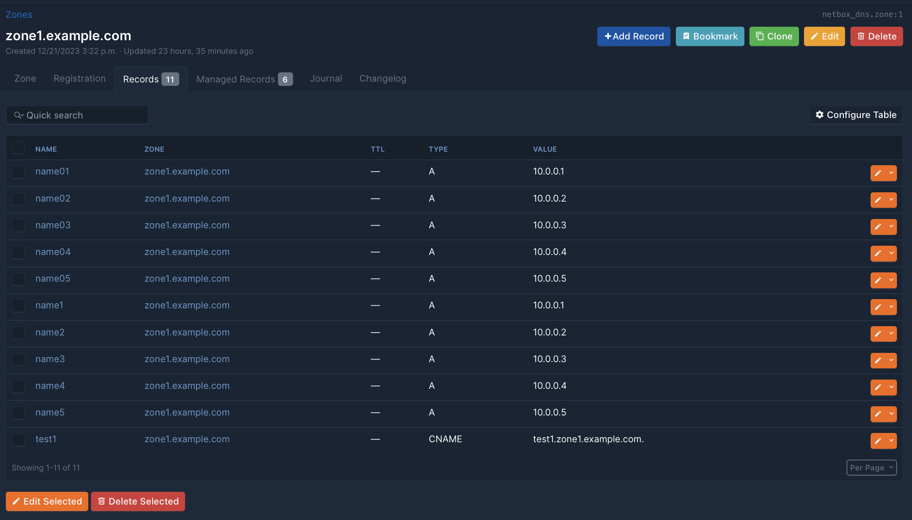

# Using NetBox DNS with Ansible
NetBox DNS has been designed to provide an intuitive and user-friendly solution for managing DNS data within NetBox. This document provides an overview of how NetBox DNS data can be used to populate DNS servers with configuration and zones. It is not intended to be a comprehensive guide to a DNS provisioning system suitable for production, but rather to illustrate the capabilities of NetBox DNS and the NetBox API.

This example uses Ansible and the `NetBox.NetBox` collection from Ansible Galaxy to show how a very simple integration can be implemented.

## Preparing NetBox
In order to utilise the NetBox API, a user account with an authentication token must be created. For the specified purpose, a read-only user with access to the NetBox DNS data is sufficient.

A new user, named 'ansible', is created using the NetBox Admin interface. The password is not required and should be sufficiently secure. Any random password of a reasonable length will suffice.


In the next step, a permission to view all NetBox DNS data must be created and assigned to the user just created.


Once the form has been submitted, the new 'ansible' user will be able to view all DNS data within NetBox. The final step is to assign that user an API authentication token. This can be done by selecting the 'API Token' navigation menu item and clicking on 'Add Token'. Select the 'ansible' user and uncheck 'Write enabled'. The token will be displayed immediately in that view.


## Preparing Ansible
For the `netbox.netbox` collection to function correctly, a recent version of Ansible running under Python 3 is required. Python 2 is no longer supported and the NetBox collection is known not to work properly with Python 2.

### Installing the `netbox.netbox` collection for Ansible
Installing the collection is straightforward.

```
# ansible-galaxy collection install netbox.netbox
Starting galaxy collection install process
Process install dependency map
Starting collection install process
Downloading https://galaxy.ansible.com/api/v3/plugin/ansible/content/published/collections/artifacts/netbox-netbox-3.17.0.tar.gz to /root/.ansible/tmp/ansible-local-219358jiz3hc9y/tmpgngehv3q/netbox-netbox-3.17.0-ywot9syj
Installing 'netbox.netbox:3.17.0' to '/root/.ansible/collections/ansible_collections/netbox/netbox'
netbox.netbox:3.17.0 was installed successfully
```

### Installing the `pynetbox` Python 3 Module
The `netbox.netbox` collection requires the `pynetbox` module to be installed.

```
# pip3 install pynetbox
Collecting pynetbox
  Downloading pynetbox-7.3.3-py3-none-any.whl.metadata (3.6 kB)
Requirement already satisfied: requests<3.0,>=2.20.0 in ./lib64/python3.11/site-packages (from pynetbox) (2.31.0)
Collecting packaging<24.0 (from pynetbox)
  Using cached packaging-23.2-py3-none-any.whl.metadata (3.2 kB)
Requirement already satisfied: charset-normalizer<4,>=2 in ./lib64/python3.11/site-packages (from requests<3.0,>=2.20.0->pynetbox) (3.3.2)
Requirement already satisfied: idna<4,>=2.5 in ./lib64/python3.11/site-packages (from requests<3.0,>=2.20.0->pynetbox) (3.6)
Requirement already satisfied: urllib3<3,>=1.21.1 in ./lib64/python3.11/site-packages (from requests<3.0,>=2.20.0->pynetbox) (2.1.0)
Requirement already satisfied: certifi>=2017.4.17 in ./lib64/python3.11/site-packages (from requests<3.0,>=2.20.0->pynetbox) (2023.11.17)
Downloading pynetbox-7.3.3-py3-none-any.whl (34 kB)
Using cached packaging-23.2-py3-none-any.whl (53 kB)
Installing collected packages: packaging, pynetbox
  Attempting uninstall: packaging
    Found existing installation: packaging 24.0
    Uninstalling packaging-24.0:
      Successfully uninstalled packaging-24.0
Successfully installed packaging-23.2 pynetbox-7.3.3
```

### Testing the API connection
Now the API connection can be tested by performing a simple lookup against NetBox. For the given purpose it is sufficient to use the `nb_lookup` plugin.

```
# ansible -m debug -a "msg={{ query('netbox.netbox.nb_lookup', \
                                    'nameservers', \
                                    plugin='netbox_dns', \
                                    api_endpoint='https://netbox.example.com/', \
                                    token='f52d8887c576df4064139e4208cca481b95110f9') }}" localhost
```
The return value confirms that the user and its permissions have been correctly set up and that the token can be used to authenticate against NetBox and access data from NetBox DNS.

```
localhost | SUCCESS => {
    "msg": [
        {
            "key": 1,
            "value": {
                "created": "2024-03-28T20:12:34.175720Z",
                "custom_fields": {},
                "description": "",
                "display": "ns1.example.com",
                "id": 1,
                "last_updated": "2024-03-28T20:12:34.175735Z",
                "name": "ns1.example.com",
                "tags": [],
                "tenant": null,
                "url": "https://netbox.example.com/api/plugins/netbox-dns/nameservers/1/",
                "zones": []
            }
        }
    ]
}
```

### Generating a zone file from NetBox DNS data
In the final step of this example, NetBox DNS data is used to create a zone file for e.g. a BIND nameserver.

#### Zone file template
A simple Jinja2 template to create a zone file is stored as `zone.db.j2`:

```
;
; Zone file for zone {{ zone.name }}
;

$TTL {{ zone.default_ttl }}


{{ record.name.ljust(32) }}    {{ (record.ttl|string if record.ttl is not none else '').ljust(8) }} IN {{ record.type.ljust(8) }}    {{ record.value }}

```

#### Ansible playbook for creating a zone
A minimalistic playbook to create a zone from that template and the NetBox DNS data for the zone "example.com" used for the screenshots of this document can now be created as `create_zonefile.yml`:

```
#!/usr/bin/env ansible-playbook

- name: Create a sample zone file
  hosts: localhost
  tasks:

    - name: Create the zone file for zone {{ zone.name }}
      template:
          src: zone.db.j2
          dest: "{{ zone.name }}.db"
      vars:
          zone: "{{ query('netbox.netbox.nb_lookup', 'zones', plugin='netbox_dns',
                           api_endpoint='https://netbox.example.com/',
                           api_filter='name=zone1.example.com',
                           token='f52d8887c576df4064139e4208cca481b95110f9')
                    | map(attribute='value')
                    | first }}"
          records: "{{ query('netbox.netbox.nb_lookup', 'records', plugin='netbox_dns',
                             api_endpoint='https://netbox.example.com/',
                             api_filter='zone='+zone.name,
                             token='f52d8887c576df4064139e4208cca481b95110f9')
                       | map(attribute='value') }}"
```

Running that playbook creates the zone file from the data in the NetBox DNS:

```
# ./create-zonefile.yml
PLAY [Create a sample zone file] ************************************************************************************
TASK [Gathering Facts] **********************************************************************************************
ok: [localhost]

TASK [Create the zone file for zone zone1.example.com] **************************************************************
changed: [localhost]

PLAY RECAP **********************************************************************************************************
localhost                  : ok=2    changed=1    unreachable=0    failed=0    skipped=0    rescued=0    ignored=0
```

As a result, a very minimal but valid zone file is created:

```
;
; Zone file for zone zone1.example.com
;

$TTL 86400

@                                            IN NS          ns1.example.com.
@                                            IN NS          ns2.example.com.
@                                   86400    IN SOA         ns1.example.com. hostmaster.example.com. 1712577231 172800 7200 2592000 3600
```

#### Updating zone data
Now some data can be added and the playbook run again to see what changes will be observed.



After running the playbook again, the resulting zone file now looks like this:

```
;
; Zone file for zone zone1.example.com
;

$TTL 86400

@                                            IN NS          ns1.example.com.
@                                            IN NS          ns2.example.com.
@                                   86400    IN SOA         ns1.example.com. hostmaster.example.com. 1712577644 172800 7200 2592000 3600
name01                                       IN A           10.0.0.1
name02                                       IN A           10.0.0.2
name03                                       IN A           10.0.0.3
name04                                       IN A           10.0.0.4
name05                                       IN A           10.0.0.5
name1                                        IN A           10.0.0.1
name2                                        IN A           10.0.0.2
name3                                        IN A           10.0.0.3
name4                                        IN A           10.0.0.4
name5                                        IN A           10.0.0.5
test1                                        IN CNAME       test1.zone1.example.com.
```

The new records have been inserted and the zone SOA SERIAL is updated in the SOA record.

#### Creating all zones organized in NetBox DNS that are active
To create all the files for use with BIND DNS, you can use the example in Synchronize_DNS_Zones. With this playbook
Ansible reads each zone that is active and writes it to a folder for BIND to read. Then the BIND service is restarted.

At the moment the zones also need to be entered manually into named.conf.local.
