# Using Custom Scripts with NetBox DNS
There are some use cases in which it seems desirable to utilise the NetBox interface for operational procedures such as provisioning external instances like authoritative DNS servers with configuration data maintained in NetBox or NetBox modules.

While this is not the primary purpose of NetBox or, specifically, NetBox DNS,  NetBox still offers the capability to provide this kind of functionality. For instance, NetBox can trigger external tools via Webhooks, run automated reports on its data models, and can also provide what are known as 'custom scripts' which are basically Python modules that operate on NetBox data.

## <a name="zone_export"></a>Exporting Zone Files from NetBox DNS
One request that was formulated in [NetBox DNS issue #8](https://github.com/peteeckel/netbox-plugin-dns/issues/8) concerns the export of zone data as zone files. This document describes the implementation of a custom script that can serve as a basis for further developments that perform this and similar actions.

### Preparing NetBox
Some configuration steps are necessary to enable the use of the exporter script.

#### Enabling the NetBox Custom Scripts Directory
By default, custom scripts are not enabled in NetBox. To enable this functionality, it is necessary to uncomment the variable `SCRIPTS_ROOT` in the NetBox configuration file `configuration.py` and have it point to a directory where scripts reside.

```
SCRIPTS_ROOT = '/opt/netbox/netbox/scripts'
```
There is an empty file `__init__.py` located in the scripts directory, which is essential for the scripts functionality to work. Do not delete that file.

Finally, please ensure that the user NetBox is running under is the owner of the scripts directory:

```
# chown -R netbox: /opt/netbox/netbox/scripts
```

NetBox needs to be restarted for these changes to become effective.

#### Granting Permissions to run Custom Scripts and view DNS data
A user who is supposed to run custom scripts must be granted the `extras.run_scripts` permission. This permission is not defined by default and must be created in the NetBox Administration interface:

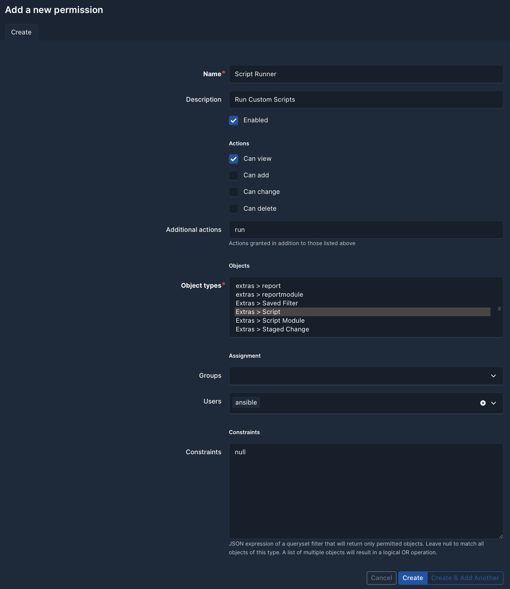

This new permission grants the right to view custom scripts, and the additional action `run`. The assignment to the user account that is to be used to run scripts (here 'ansible') can be done in the same step.

Additionally, a permission to view all DNS data is needed and must be created and assigned to the user account to be allowed to run scripts in the same way:

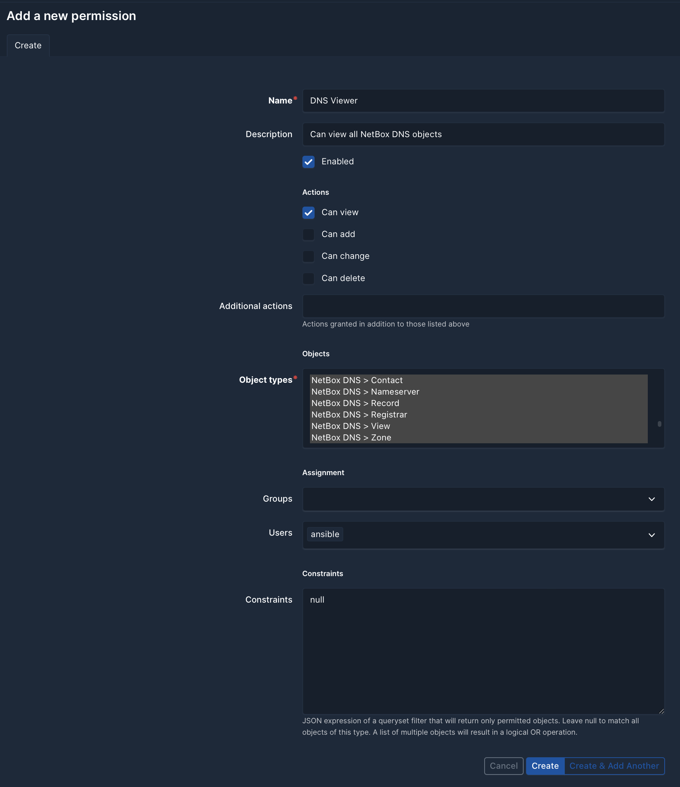

#### Installing the Exporter Script
After these preparations, the example custom script `netbox_dns_exporters.py` can be installed using the NetBox GUI. Navigate to 'Customization/Scripts' in the sidebar, click on '+' and select the file containing the script for upload in the following dialog:

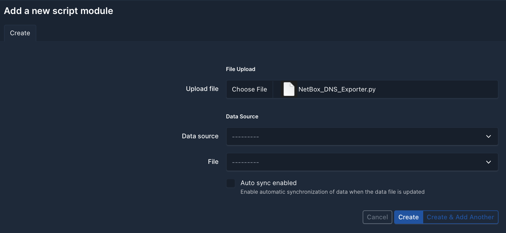

After clicking on 'Create' to install the script it can now be used to export zone data to the file system.

### Running the Exporter Script
To run the script, navigate to the 'Customization' tab in the side bar and select the 'Scripts' menu entry.

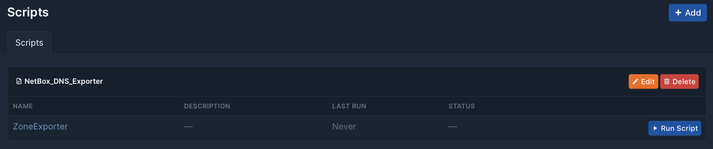

The Script has the name 'Zone Exporter'. After selecting this entry from the menu, some parameters are requested before running it.

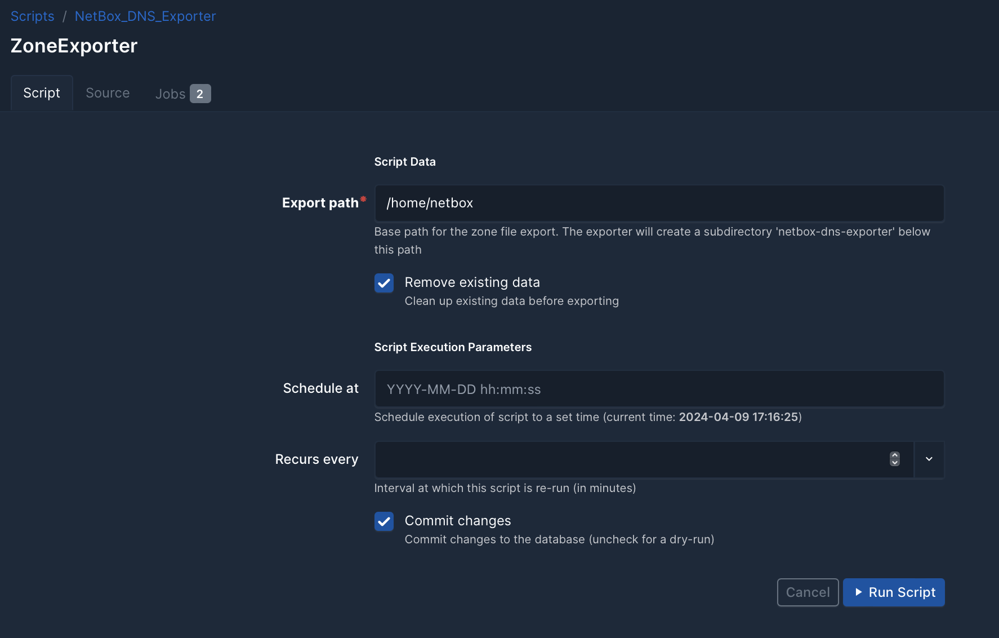

#### Export Path
The base path within the file system on the NetBox node where the export takes place. This directory must be writable for the NetBox user. By default, the NetBox home directory is used.

The exporter creates a sub-directory `netbox-dns-exporter` under the specified base path to prevent zone files from being overwritten accidentally and to make deleting existing exports less risky. Make sure that there are no subdirectories of this name containing relevant data, as these may be overwritten or deleted by the exporter.

#### Remove existing data
If selected, delete all data from the `netbox-dns-exporter` subdirectory before starting the export. This is a means to ensure that zone files for zones that have been deactivated or deleted are not retained from previous exports.

#### Commit changes
This is an option provided by the NetBox Custom Script mechanism. As the exporter script does not modify any data in the NetBox database, the setting is not applicable.

#### Run Script
Once the configuration options have been set or the default options accepted, the script can be run by clicking the 'Run Script' button.

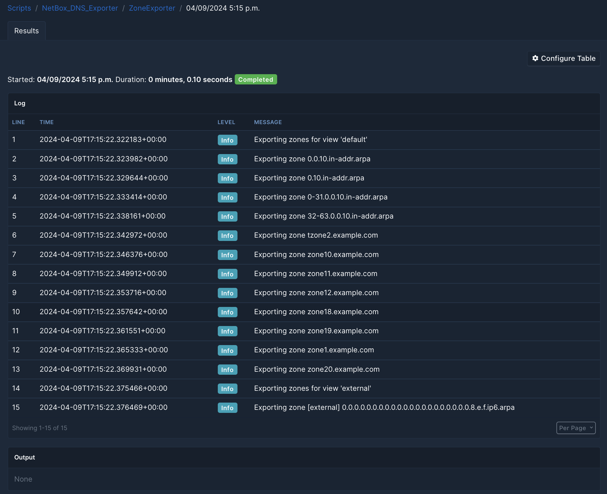

Once the execution process has been completed, the exported zone data files should be created in the selected directory.

```
[netbox@example ~]$ tree netbox-dns-exporter/
netbox-dns-exporter/
├── default
│   ├── 0.0.10.in-addr.arpa.db
│   ├── 0.10.in-addr.arpa.db
│   ├── 0-31.0.0.10.in-addr.arpa.db
│   ├── 32-63.0.0.10.in-addr.arpa.db
│   ├── tzone2.example.com.db
│   ├── zone10.example.com.db
│   ├── zone11.example.com.db
│   ├── zone12.example.com.db
│   ├── zone18.example.com.db
│   ├── zone19.example.com.db
│   ├── zone1.example.com.db
│   └── zone20.example.com.db
└── external
    └── 0.0.0.0.0.0.0.0.0.0.0.0.0.0.0.0.0.0.0.0.0.8.e.f.ip6.arpa.db
```

### Caveats
Please be aware that this is a very simple exporter script that is intended to serve as a foundation for users' own developments. It has not undergone extensive security auditing and is provided as-is. It should not be used in production without further scrutiny.

### Further Considerations
Providing a functionality like the one of this script in the plugin itself is not currently being considered. Provisioning a DNS server is not in scope of the NetBox DNS plugin, which has been designed as a source of truth, not a management interface. This is in concordance with the NetBox project itself.

The way in which a plugin would interact with authoritative and slave DNS servers varies so significantly between platforms, implementations, server products and installations that it would mean an enormous effort to cater for all these variants.

On the other hand, there are many ways in which NetBox can be customised, so anyone with special requirements should be able to adapt it to their needs. One way of doing this has been outlined in this example.

See the discussion in [NetBox DNS issue #8](https://github.com/auroraresearchlab/netbox-dns/issues/8).


## Applying Tenancy to Managed Records
Tenancy is a concept that is highly dependent on organisational processes within in the environment in which NetBox is used. As a result, it is challenging to implement a generic functionality that applies tenancy to objects created by NetBox DNS like `NS` or `SOA` records for zones or `PTR` records for address records. For this reason, the standard implementation of NetBox DNS does not apply tenancy to such objects and does not make any assumptions about whether or not tenancy should be applied to them.

In the concrete case, however, it may be desirable to apply tenancy to such objects, see for example discussion [#247](https://github.com/peteeckel/netbox-plugin-dns/discussions/247) in  GitHub.

The example custom scripts, 'RecordTenancySynchronizer' and 'IPAddressTenancySynchronizer', located in the 'examples' directory, can be used as a basis for developing similar scripts demonstrating how this functionality can be implemented.

The preparation and installation of the custom scripts follows a similar process to that described for the [Zone Export](#zone_export) script. However, these scripts are not used directly as in [Running the Exporter Script](#run_export_script), but instead the scripts are used as actions for NetBox event rules, and so there is no need to create a user for running the scripts.

### Checking the Installation of the Tenancy Scripts
If the scripts have been successfully installed, they are listed under 'Customization'/'Scripts' like this:

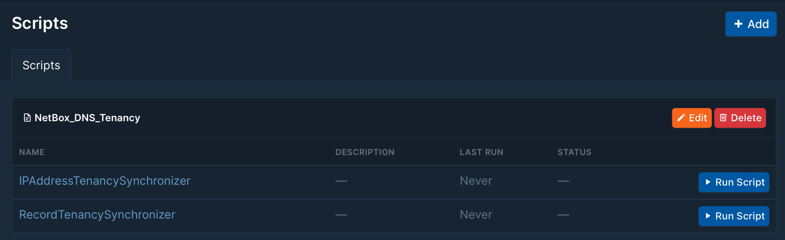

### Creating Event Rules
The next step is to create event rules in the NetBox GUI. To do this, navigate to 'Operations'/'Event Rules' and klick on 'Add'. In the following form, enter a name for the new event rule, then select 'NetBox DNS Record' as the object type and 'Creations' and 'Updates' as the events to trigger on.

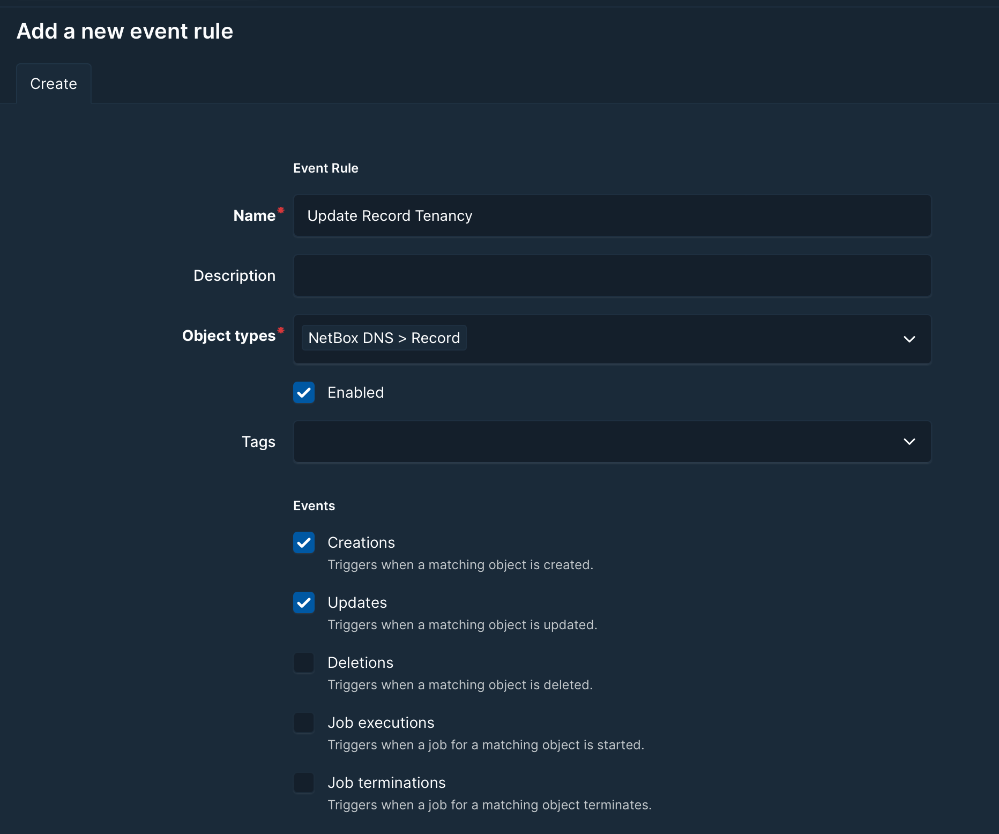

In the next step, scroll further down and select 'Script' for the action type and the name of the custom script, in this case `RecordTenancySynchronizer`, as the script.

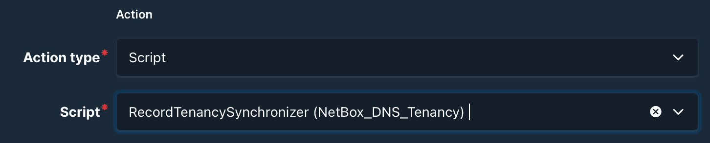

It is advisable to define conditions for triggering the scripts in order to prevent unnecessary invocations. Potential conditions for the `RecordTenancySynchronizer` could be:

```json
{
    "and": [
        {
            "attr": "ptr_record",
            "value": null,
            "negate": true
        }
    ]
}
```

For more details on defining conditions, see the [NetBox Documentation](https://demo.netbox.dev/static/docs/reference/conditions/).

The process is analogous for `IPAddressTenancySynchronizer`.

### Verification of Operation
The above configuration should result in the scripts running whenever an address record for which an automatically generated PTR record exists. To verify the execution, navigate to 'Customization'/'Scripts' and select the script. Then, navigate to the 'Jobs' tab:

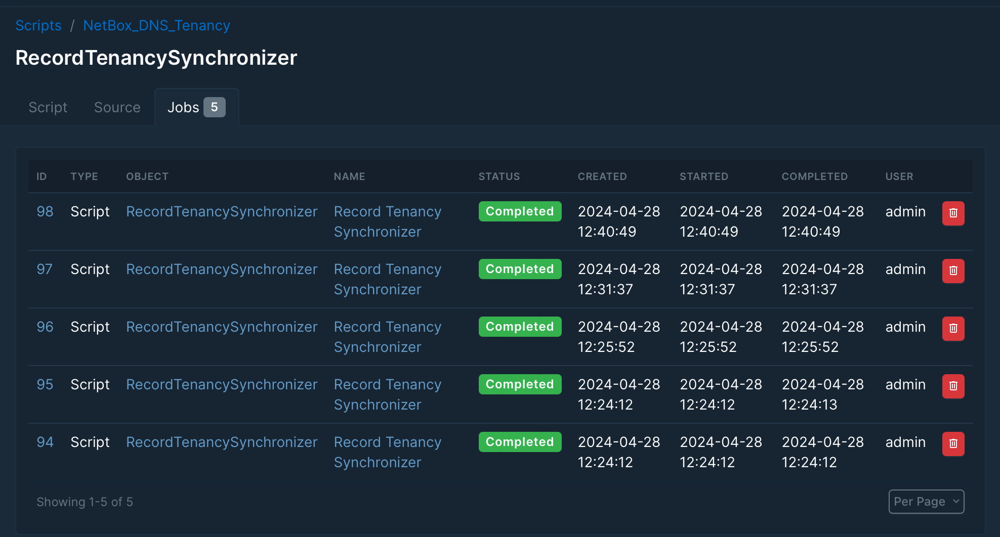

A click on the Job ID in the first column provides more detail:

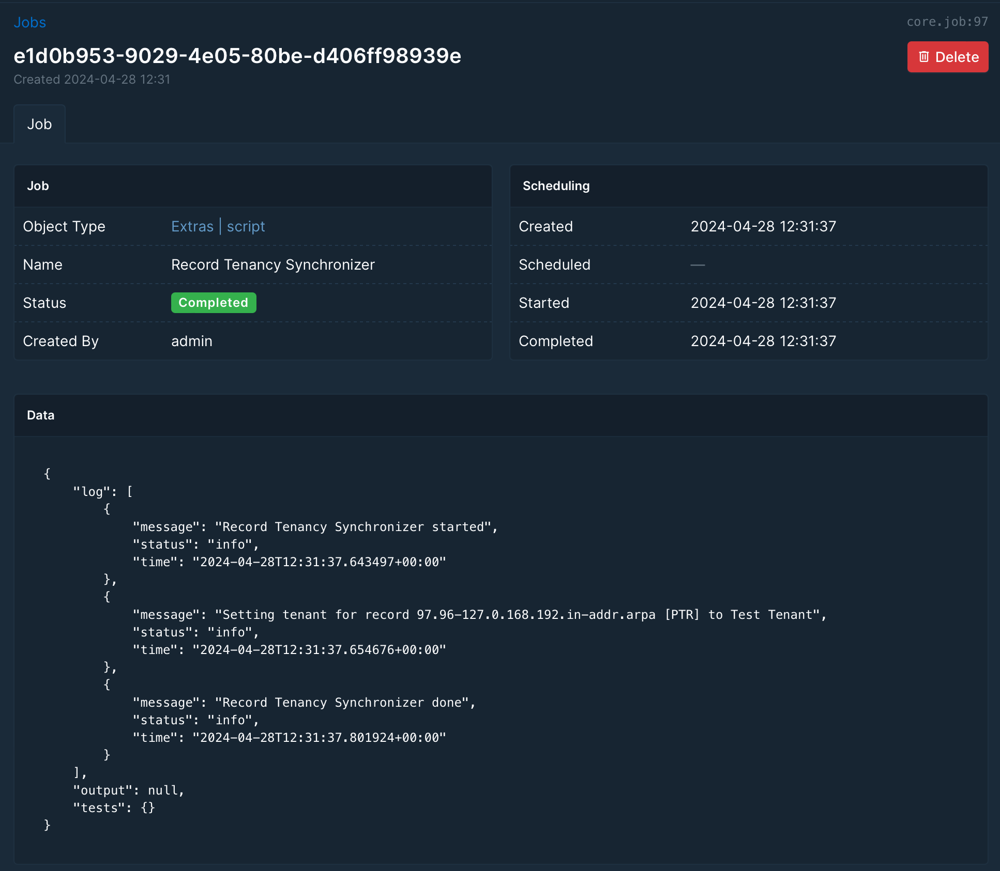
